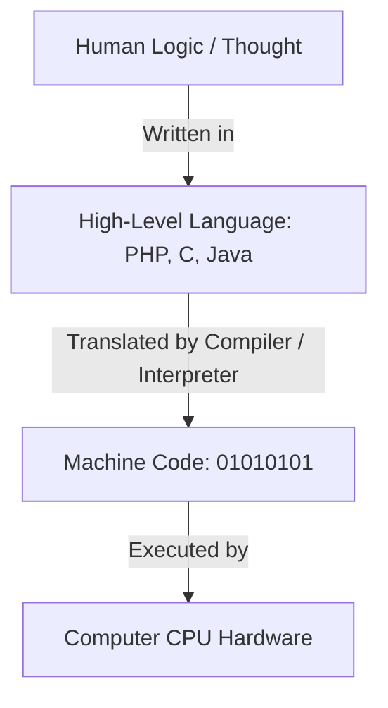
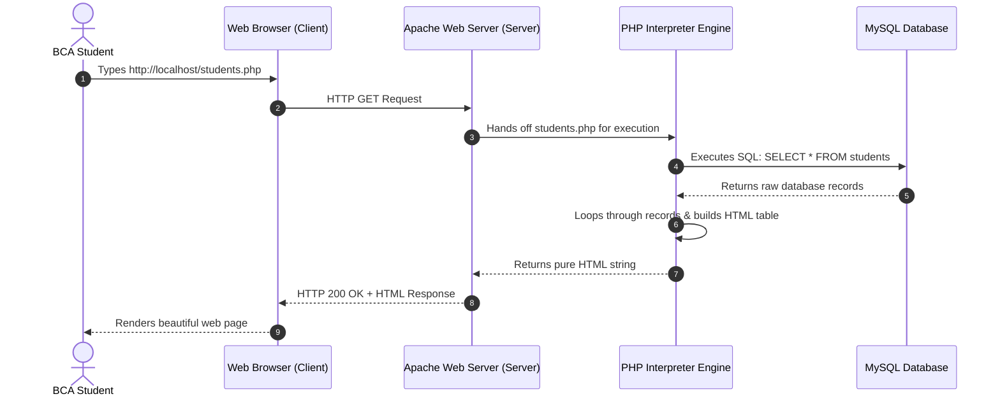

# Part 0: Programming & Web Foundations
## Zero-Level Prerequisites for First-Year BCA Students

---

### Introduction: Why This Chapter Exists
Before we write a single line of PHP code, we must understand how computers, software, the internet, and web applications actually function. Many students struggle with programming not because programming is inherently difficult, but because fundamental concepts like **interpreters**, **servers**, **HTTP requests**, and **databases** were never explained clearly. 

This chapter establishes a rock-solid mental model of modern web architecture so that every subsequent concept in PHP feels natural and intuitive.

---

### 1. What is a Computer Program?
- **Plain English Explanation**: A computer is essentially an electronic machine that can perform millions of calculations per second, but it has zero intelligence of its own. It cannot think, guess, or make decisions unless told exactly what to do. A **computer program** is an ordered set of step-by-step instructions written to guide a computer to perform a specific task or solve a particular problem.
- **Real-World Analogy**: Think of a culinary recipe for baking a chocolate cake. The recipe lists the exact ingredients and step-by-step instructions: *"1. Preheat the oven to 180°C. 2. Whisk 2 eggs with sugar. 3. Add flour."* If you follow the instructions in order, you get a cake. A computer program is simply a recipe for the computer processor (CPU).
- **Exam Definition**: *A computer program is a sequence of structured instructions written in a language that a computer can interpret and execute to perform a predefined computational task or solve a specific problem.*

---

### 2. What is Programming?
- **Plain English Explanation**: **Programming** (also known as coding or software engineering) is the intellectual process of designing, writing, testing, debugging, and maintaining the instructions that make up a computer program.
- **Why It Exists**: Humans communicate using natural languages like English, Hindi, or Punjabi, full of slang and ambiguous expressions. Computer microprocessors only understand binary numbers (sequences of `0`s and `1`s representing electrical voltage levels). Programming is the craft of translating human logic into structured machine instructions.
- **Exam Definition**: *Programming is the systematic process of designing, formulating, writing, testing, and debugging source code in a programming language to instruct a computer to accomplish a computational goal.*

---

### 3. What is a Programming Language?
- **Plain English Explanation**: A **programming language** is a formal, standardized vocabulary and set of grammatical rules (syntax) used to communicate instructions to a computer.
- **Levels of Languages**:
  1. **Low-Level Machine Language**: Composed entirely of binary bits (`01001011`). Extremely fast, but virtually impossible for humans to write and maintain without error.
  2. **Assembly Language**: Uses symbolic mnemonics (like `MOV`, `ADD`, `SUB`) representing direct processor instructions. Still heavily dependent on specific processor hardware.
  3. **High-Level Languages (C, C++, Java, PHP, Python)**: Uses English-like words, mathematical symbols, and structured logic (like `if`, `while`, `function`, `echo`). High-level languages are hardware-independent and human-readable.



---

### 4. What is Source Code?
- **Plain English Explanation**: **Source code** is the raw, human-readable text file that a programmer types into a code editor. It contains statements, comments, variables, and algorithms written according to the rules of a specific programming language.
- **File Extensions**: Source code is saved in standard text files with language-specific extensions:
  - PHP source code: `index.php`, `login.php`
  - C source code: `main.c`
  - Java source code: `App.java`
- **Exam Definition**: *Source code refers to the collection of computer instructions written using a human-readable high-level programming language, typically preserved in plain-text format before being compiled or interpreted.*

---

### 5. What is a Compiler?
- **Plain English Explanation**: A **compiler** is a specialized computer program that takes the **entire** source code of a program at once, analyzes it, checks for syntax errors, and translates the entire file into a standalone executable file (such as a `.exe` on Windows or a binary file on Linux/Mac).
- **How It Works**: If there is even one syntax error anywhere in the file, the compiler halts and produces no output file. Once compiled successfully, the resulting machine code program can run directly on the operating system without needing the original source code or the compiler.
- **Examples**: C, C++, Rust, Go.
- **Analogy**: A book translator who translates an entire 500-page English novel into Hindi before sending the printed Hindi book to the bookstore.

---

### 6. What is an Interpreter?
- **Plain English Explanation**: An **interpreter** is a program that reads, analyzes, and executes source code **line by line**, on the fly, directly in real time.
- **How It Works**: The interpreter reads line 1, translates it into machine code, and immediately executes it. Then it moves to line 2. If it encounters an error on line 10, lines 1 through 9 have already executed and produced their effects before the script crashes.
- **Examples**: PHP, Python, JavaScript, Ruby.
- **Analogy**: A live United Nations speech interpreter who translates a diplomat's speech sentence by sentence in real time over earphones.

#### Comparison Table: Compiler vs Interpreter (High-Frequency Exam Question)

| Feature | Compiler | Interpreter |
| :--- | :--- | :--- |
| **Translation Unit** | Translates the entire source program at once. | Translates and executes statement by statement. |
| **Output File** | Generates an intermediate/standalone object or machine code file (`.exe`, `.bin`). | Generates no permanent intermediate object file; executes directly in RAM. |
| **Execution Speed** | Extremely fast execution after compilation. | Slower execution because translation happens at runtime. |
| **Error Detection** | Reports all syntax errors only after scanning the entire file. | Halts execution immediately at the exact line where an error occurs. |
| **Development Cycle** | Requires explicit re-compilation step after every code edit. | Fast edit-and-run development cycle (refresh browser to test). |
| **Example Languages** | C, C++, Go, Rust, Swift. | PHP, Python, JavaScript, Ruby. |

---

### 7. What is a Scripting Language?
- **Plain English Explanation**: A **scripting language** is a programming language designed primarily for integrating, automating, manipulating, and communicating with existing software environments (such as a web server, an operating system shell, or a web browser) without requiring a separate compilation step.
- **Key Characteristics**:
  - Almost all scripting languages are interpreted or just-in-time compiled.
  - They allow rapid application development (write a script and run it immediately).
  - PHP is formally defined as a **Server-Side Scripting Language**.

---

### 8. What is HTML?
- **Full Form**: **H**yper**T**ext **M**arkup **L**anguage.
- **Plain English Explanation**: HTML is **not** a programming language because it does not have logic, conditions (`if`), loops (`for`), or math calculations. Instead, it is a **markup language**. It uses tags (like `<h1>`, `<p>`, `<table>`, `<form>`) to tell the web browser how content should be structured on a web page.
- **Role in Web**: HTML is the **skeleton/bones** of a website. It defines what text, images, tables, inputs, and buttons appear on the screen.

---

### 9. What is CSS?
- **Full Form**: **C**ascading **S**tyle **S**heets.
- **Plain English Explanation**: CSS is a styling language used to describe the visual presentation and layout of an HTML document.
- **Role in Web**: CSS is the **skin, clothes, and makeup** of a website. It controls colors, fonts, spacing, margins, borders, animations, grid arrangements, and responsive layouts across mobile phones, tablets, and desktop monitors.

---

### 10. What is JavaScript?
- **Plain English Explanation**: JavaScript is a high-level programming language that runs inside the user's web browser (client-side).
- **Role in Web**: JavaScript is the **muscles and nervous system** of a website. It provides interactivity: pop-up dialogs, client-side form validation before submission, sliders, dropdown animations, and dynamic content loading without reloading the entire page (AJAX).

---

### 11. What is PHP?
- **Full Form**: Originally stood for *Personal Home Page tools* (created by Rasmus Lerdorf in 1994). Today, it is a recursive acronym: **P**HP: **H**ypertext **P**reprocessor.
- **Plain English Explanation**: PHP is an open-source, general-purpose, server-side scripting language specifically engineered for web development. It runs on the web server, executes business logic, communicates with databases, handles user authentication, reads and writes files, and generates clean HTML that is sent back to the browser.
- **Exam Definition**: *PHP is an open-source, interpreted, server-side scripting language that can be embedded into HTML to create dynamic, database-driven web applications.*

---

### 12. What is MySQL?
- **Plain English Explanation**: MySQL is the world's most popular open-source **Relational Database Management System (RDBMS)**. It stores, organizes, and retrieves structured data (like registered usernames, encrypted passwords, student marks, and product catalogs) using Structured Query Language (SQL).
- **Why It Matters with PHP**: PHP and MySQL form the legendary "dynamic duo" of web development. PHP handles the logic, while MySQL handles permanent data storage.

---

### 13. What is a Database?
- **Plain English Explanation**: A **database** is an organized, secure, digital collection of related data stored electronically in a computer system.
- **Why Not Use a Simple Text File or Excel Sheet?**:
  - Text files become corrupt when hundreds of users write to them at the exact same millisecond.
  - Databases support concurrent transactions, lightning-fast indexed searches, data integrity constraints, user permission security, and automatic backup/recovery.

---

### 14. What is a Web Server?
- **Plain English Explanation**: A **web server** refers to both hardware and software:
  1. **Hardware**: A computer connected to the internet 24/7 that stores website files (HTML, CSS, PHP scripts, images).
  2. **Software**: A specialized program (such as **Apache** or **Nginx**) running on that computer that listens for incoming web requests over network ports (Port 80 for HTTP, Port 443 for HTTPS) and sends back the requested web pages.
- **Analogy**: A web server is like a restaurant waiter. You (the client) sit at a table and make an order (request). The waiter takes the order to the kitchen, gets the prepared food, and serves it back to your table (response).

---

### 15. What is a Browser?
- **Plain English Explanation**: A **web browser** (e.g., Google Chrome, Mozilla Firefox, Apple Safari, Microsoft Edge) is a client-side software application installed on a user's computer or smartphone.
- **Core Function**: The browser makes HTTP requests to web servers, downloads HTML, CSS, JavaScript, and images, and renders them visually into an interactive graphical user interface that humans can see and click.
- **Crucial Rule**: **A web browser CANNOT execute PHP code directly.** If you try to open a `.php` file directly in Chrome using `file:///C:/mycode.php`, Chrome will simply display the raw PHP source code as plain text or prompt you to download the file. PHP can only be executed by a web server running a PHP interpreter!

---

### 16. Client vs Server: The Fundamental Architecture
The entire internet is structured on the **Client-Server Architecture**.



#### Detailed Comparison: Client vs Server

| Feature | Client (Frontend) | Server (Backend) |
| :--- | :--- | :--- |
| **Where it Runs** | On the user's local machine (PC, Laptop, Smartphone). | On a remote computer or local host running server software. |
| **Primary Software** | Web Browser (Chrome, Firefox, Safari). | Web Server (Apache, Nginx) + PHP + MySQL. |
| **Technologies** | HTML, CSS, JavaScript. | PHP, Python, Java, Node.js, SQL. |
| **Source Code Visibility** | Anyone can right-click and choose **"View Page Source"** to see all HTML, CSS, and client-side JS. | **Invisible to the public.** PHP code executes on the server; only the final generated output (HTML) is sent to the client. |
| **Security Role** | Cannot be trusted. Users can disable JavaScript or tamper with form inputs. | The fortress of security. Validates all data, handles encryption, sessions, and database access. |

---

### 17. Static vs Dynamic Websites
- **Static Website**:
  - Consists of pre-written HTML, CSS, and image files stored on the server.
  - Every single visitor sees the exact same content at all times.
  - To change information on the website, a webmaster must manually edit the HTML files and re-upload them.
- **Dynamic Website**:
  - The web page is constructed on-the-fly by a server-side script (PHP) at the exact moment a user requests it.
  - The content changes based on who is logged in, what time it is, what search filters are applied, or what records exist in the database.
  - Example: When student *Aman* logs into the BCA portal, the page displays *"Welcome, Aman! Your Roll No is 101."* When *Simran* logs in, the exact same PHP script displays *"Welcome, Simran! Your Roll No is 102."*

---

### 18. The Request / Response Cycle
Every interaction on the World Wide Web consists of two distinct halves:
1. **The HTTP Request**: The client asks the server for something (*"Please give me `profile.php`"* or *"Please save this student form data"*).
2. **The HTTP Response**: The server processes the request and replies (*"Here is the HTML page you requested"* or *"Data saved successfully"*).

---

### 19. HTTP Basics (Hypertext Transfer Protocol)
- **What is HTTP?**: The standard protocol (set of rules) that governs how messages are formatted and transmitted between web browsers and web servers.
- **HTTP Methods**:
  - **GET**: Used to request and retrieve data from the server. Data parameters are visible in the browser address bar (URL query string). Example: Searching for a book: `search.php?query=php`.
  - **POST**: Used to submit data to the server to be processed (e.g., login credentials, student registration forms, file uploads). Data is transmitted securely inside the HTTP request body and is not visible in the URL.
- **Common HTTP Status Codes (Frequently asked in viva)**:
  - `200 OK`: Request succeeded, web page returned.
  - `301 / 302 Found (Redirect)`: The resource has moved; the browser is redirected to a new URL.
  - `400 Bad Request`: Server cannot understand the request.
  - `401 Unauthorized / 403 Forbidden`: Access denied (authentication required).
  - `404 Not Found`: The requested file or URL does not exist on the server.
  - `500 Internal Server Error`: The PHP script crashed due to a syntax error or runtime exception.

---

### 20. What is a URL?
- **Full Form**: **U**niform **R**esource **L**ocator (commonly known as a web address).
- **Anatomy of a URL**:
```text
https://www.ptu.ac.in:443/bca/syllabus.php?semester=1&subject=php#unit1
|___|   |____________| |_| |____________| |_____________________| |____|
  |           |         |         |                  |               |
Protocol    Domain    Port      Path            Query String      Fragment
```
- **Protocol** (`http://` or `https://`): Rules used for communication (`https` is encrypted with SSL/TLS).
- **Domain Name / Host** (`localhost` or `www.ptu.ac.in`): The human-friendly name of the server computer.
- **Port** (`:80` for HTTP, `:443` for HTTPS): The software communication door on the server.
- **Path** (`/bca/syllabus.php`): The exact directory and file on the server.
- **Query String** (`?semester=1&subject=php`): Key-value pairs sent to the PHP script via GET.
- **Fragment / Anchor** (`#unit1`): Jumps to a specific section within the HTML page.

---

### 21. What is `localhost` and `127.0.0.1`?
- **Plain English Explanation**: In computer networking, `localhost` is a special domain name that means **"this computer that I am sitting at right now."**
- **Loopback IP Address**: `localhost` always resolves to the loopback IP address `127.0.0.1`.
- When you type `http://localhost` into your browser, your browser does not connect to the internet or an external server. Instead, it loops right back into your own operating system and connects to the Apache web server running locally on your own PC!

---

### 22. What is Apache?
- **Plain English Explanation**: The **Apache HTTP Server** is one of the most widely used, open-source, battle-tested web server software applications in the world, maintained by the Apache Software Foundation.
- **Its Job**: It runs silently in the background of your operating system. When a request comes in for a static file (like `.html` or `.jpg`), Apache serves it directly. When a request comes in for a `.php` file, Apache passes the file to the PHP interpreter engine, waits for the generated HTML, and sends it back to the requesting browser.

---

### 23. What are XAMPP, WAMP, and LAMP?
Setting up a professional web environment manually requires downloading Apache, compiling PHP, installing MySQL, configuring network ports, and editing configuration files like `httpd.conf` and `php.ini`. This can be daunting for a first-year student.

To solve this, software engineers created **All-in-One Local Development Stacks**:
- **XAMPP**:
  - **X**: Cross-platform (runs on Windows, Linux, and macOS)
  - **A**: Apache (Web Server)
  - **M**: MariaDB / MySQL (Database Server)
  - **P**: PHP (Scripting Language Interpreter)
  - **P**: Perl (Scripting Language)
- **WAMP**: **W**indows + **A**pache + **M**ySQL + **P**HP (Windows only).
- **LAMP**: **L**inux + **A**pache + **M**ySQL + **P**HP (The gold-standard Linux web server environment).
- **MAMP**: **M**acintosh + **A**pache + **M**ySQL + **P**HP (macOS oriented).

---

### 24. The Big Picture: Relationship Between PHP, Apache, and MySQL

Here is the master architectural diagram that every BCA student must understand and be able to draw in exams:

```text
+-------------------------------------------------------------------------------+
|                             CLIENT TIER (User's PC)                           |
|                                                                               |
|      +-----------------------------------------------------------------+      |
|      |                       WEB BROWSER                               |      |
|      |                (Google Chrome / Mozilla Firefox)                |      |
|      +-----------------------------------------------------------------+      |
+--------------------------|----------------------------^-----------------------+
                           |                            |
          1. HTTP Request  |                            |  6. Pure HTML/CSS
             (GET / POST)  |                            |     Response
                           v                            |
+-------------------------------------------------------|-----------------------+
|                             SERVER TIER (Web Server)                          |
|                                                                               |
|      +-----------------------------------------------------------------+      |
|      |                   APACHE WEB SERVER                             |      |
|      |    (Listens on Port 80, receives request, identifies .php file) |      |
|      +-------------------|---------------------------------------------+      |
|                          |                                    ^               |
|         2. Passes script |                                    | 5. Clean HTML |
|            to interpreter|                                    |    output     |
|                          v                                    |               |
|      +-----------------------------------------------------------------+      |
|      |                   PHP INTERPRETER ENGINE                        |      |
|      |    (Executes logic, loops, builds HTML, prepares SQL query)     |      |
|      +-------------------|----------------------------^----------------+      |
|                          |                            |                       |
|          3. SQL Query    |                            | 4. Database Records   |
|             (PDO/mysqli) |                            |    (Arrays/Objects)   |
|                          v                            |                       |
|      +-----------------------------------------------------------------+      |
|      |                   MySQL / MariaDB DATABASE                      |      |
|      |    (Stores tables, student records, passwords on disk)          |      |
|      +-----------------------------------------------------------------+      |
+-------------------------------------------------------------------------------+
```

#### Detailed Step-by-Step Explanation of Every Arrow:
1. **Arrow 1 (Browser $\rightarrow$ Apache)**: The student opens Chrome and navigates to `http://localhost/bca/students.php`. Chrome packages this intent into a standard **HTTP GET Request** and transmits it over the local network stack to Apache listening on Port 80.
2. **Arrow 2 (Apache $\rightarrow$ PHP Interpreter)**: Apache examines the URL path. It notices the file extension ends in `.php`. Apache knows it cannot execute PHP by itself, so it hands the file path to the **PHP Engine** (via `mod_php` or FastCGI).
3. **Arrow 3 (PHP Interpreter $\rightarrow$ MySQL Database)**: Inside `students.php`, PHP encounters database code: `$pdo->query("SELECT * FROM students")`. PHP establishes a network socket connection to MySQL (usually on Port 3306) and sends the SQL string.
4. **Arrow 4 (MySQL Database $\rightarrow$ PHP Interpreter)**: The MySQL database engine locates the table on disk, gathers the matching student records, and sends them back to PHP as a structured data set (tabular rows).
5. **Arrow 5 (PHP Interpreter $\rightarrow$ Apache)**: The PHP engine loops through the database records (`foreach`), interpolates the names into an HTML `<table>` structure, and completes execution. It hands the resulting pure HTML string back to Apache.
6. **Arrow 6 (Apache $\rightarrow$ Browser)**: Apache adds HTTP response headers (`HTTP/1.1 200 OK`, `Content-Type: text/html`) and transmits the HTML over the network back to Chrome. Chrome parses the HTML and displays the final table on screen. 

> [!IMPORTANT]
> Notice that the browser **NEVER** receives any PHP code! The PHP code lived and died entirely on the server. The client only receives the final rendered HTML.

---

### Part 0: Examination Notes & Viva Questions

#### Most Likely 2-Mark & 5-Mark Exam Questions:
1. *Differentiate between a Compiler and an Interpreter with examples.*
2. *Explain the Client-Server Architecture in web applications.*
3. *What is the difference between a Static website and a Dynamic website?*
4. *What is XAMPP? Explain the role of each component.*
5. *Why is PHP called a Server-Side Scripting Language?*

#### Viva Voce Quick-Fire Preparation:
- **Q: Can Google Chrome run PHP files directly from my Desktop?**
  - **A**: No, sir. Chrome has a JavaScript engine (V8), but it does not have a PHP interpreter. PHP files must be served by a web server (like Apache) that passes the file through the PHP interpreter engine.
- **Q: What is the default port for HTTP and MySQL in XAMPP?**
  - **A**: Apache HTTP runs on Port **80** (and 443 for HTTPS); MySQL runs on Port **3306**.
- **Q: Where must PHP files be placed inside a XAMPP installation on Windows?**
  - **A**: Inside the `htdocs` directory (typically `C:\xampp\htdocs\`).
