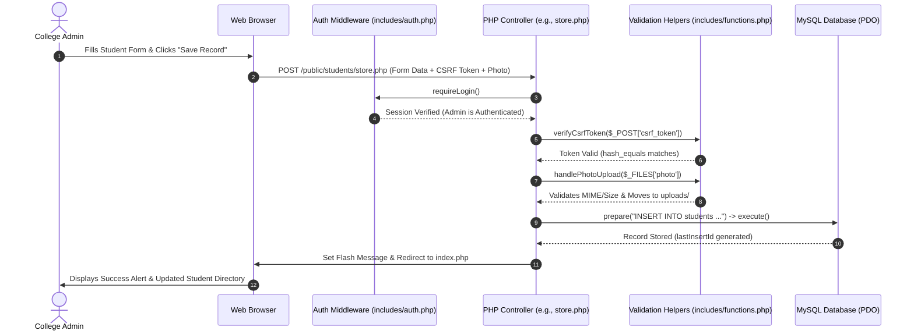

# Project Manual: Student Management System
## Complete Line-by-Line Architectural Guide for Software & Web Development Aspirants

---

### Project Architectural Overview

The **Student Management System** follows a clean, modular Model-View-Controller (MVC) inspired pattern tailored for beginner comprehension and real-world web architecture. The following sequence diagram details the full lifecycle from browser request to database update:



---

## Complete File-by-File Breakdown & Code Explanation

### 1. `config/database.php`
- **1. What It Does**: Configures and establishes the object-oriented PDO database connection to MySQL.
- **2. Why It Exists**: Centralizes database credentials in one secure location. If the database password or port changes, you update this single file rather than modifying dozens of queries throughout the project.
- **3. How It Connects**: Included at the top of every controller (`login.php`, `dashboard.php`, `store.php`, `update.php`, etc.) using `require_once`.
- **4. Key Code Highlights**:
  - `PDO::ATTR_ERRMODE => PDO::ERRMODE_EXCEPTION`: Configures PDO to immediately throw a `PDOException` whenever a query fails.
  - `PDO::ATTR_DEFAULT_FETCH_MODE => PDO::FETCH_ASSOC`: Ensures database records are returned as intuitive associative arrays (`$row['email']`).
  - `PDO::ATTR_EMULATE_PREPARES => false`: Enforces true server-side prepared statements, eliminating SQL injection vulnerability.

---

### 2. `database/schema.sql`
- **1. What It Does**: Contains the Data Definition Language (DDL) and initial seed data for creating the database and tables.
- **2. Why It Exists**: Allows any student, examiner, or deployment server to recreate the exact database schema and seed data in seconds.
- **3. How It Connects**: Imported into MySQL via phpMyAdmin or the MySQL command line client before running the application.
- **4. Key Code Highlights**:
  - `ENGINE=InnoDB`: Uses the transactional InnoDB storage engine supporting relational integrity.
  - `CHARSET=utf8mb4`: Supports full multilingual Unicode text and emoji characters.
  - `password_hash('AdminPassword123', PASSWORD_BCRYPT)`: Pre-computes the initial administrative password hash.

---

### 3. `includes/auth.php`
- **1. What It Does**: Manages user login state, session cookies, and route protection.
- **2. Why It Exists**: Enforces security boundaries. Without route protection, unauthorized visitors could guess URLs like `students/create.php` and manipulate sensitive university records.
- **3. How It Connects**: Included by `includes/header.php` and called at the top of all protected controllers.
- **4. Key Functions**:
  - `isLoggedIn()`: Returns `true` if `$_SESSION['user_id']` is present.
  - `requireLogin()`: Guards administrative routes. Redirects guests to `login.php` with a flash alert.
  - `requireGuest()`: Prevents logged-in users from seeing the login screen, redirecting them to `dashboard.php`.
  - `loginUser($user)`: Stores user details in session and calls `session_regenerate_id(true)` to prevent Session Fixation attacks.
  - `logoutUser()`: Cleans up `$_SESSION`, destroys the browser cookie, and terminates the server session.

---

### 4. `includes/flash.php`
- **1. What It Does**: Manages temporary flash status notifications across HTTP redirects.
- **2. Why It Exists**: When a form is submitted (POST), HTTP standards recommend redirecting the user to a display page (POST/Redirect/GET pattern) to prevent accidental duplicate submissions when refreshing the browser. Flash messages carry success/error alerts across that redirect.
- **3. Key Functions**:
  - `setFlash($type, $message)`: Queues an alert in `$_SESSION['flash_messages']`.
  - `renderFlash()`: Renders queued messages as animated, dismissible Bootstrap 5 alerts and clears them from memory.

---

### 5. `includes/functions.php`
- **1. What It Does**: Global security and utility toolbox.
- **2. Why It Exists**: Prevents code duplication for XSS escaping, CSRF verification, and secure file handling.
- **3. Key Functions**:
  - `e($value)`: Escapes special characters using `htmlspecialchars(..., ENT_QUOTES, 'UTF-8')`.
  - `getCsrfToken()` & `verifyCsrfToken()`: Generates and verifies cryptographic Anti-CSRF tokens using `hash_equals()`.
  - `handlePhotoUpload()`: Validates file extensions (`jpg`, `jpeg`, `png`, `webp`), restricts sizes to 2MB, checks the binary MIME signature with `finfo_file()`, and generates collision-free filenames with `bin2hex(random_bytes(8))`.
  - `deleteUploadedPhoto()`: Safely unlinks an image file using `basename()` to prevent path traversal.

---

### 6. `includes/header.php` & `includes/footer.php`
- **1. What They Do**: Form the master graphical layout shell wrapping every page.
- **2. Why They Exist**: Adheres to the DRY (Don't Repeat Yourself) principle. Changes to navigation links, university logos, or stylesheet links are made in one file and automatically reflected everywhere.
- **3. Key Code Highlights**:
  - Dynamically calculates relative paths (`$rootPath`, `$assetPath`) whether a file is in `public/` or `public/students/`.
  - Highlights the currently active navigation tab using `$currentPage`.
  - Automatically invokes `renderFlash()` at the top of the main container.

---

### 7. `public/login.php` & `public/logout.php`
- **1. What They Do**: Handle administrative authentication.
- **2. How They Work**:
  - Verifies submitted CSRF token.
  - Queries `users` table via PDO prepared statement: `SELECT * FROM users WHERE email = :email LIMIT 1`.
  - Validates password using `password_verify($password, $user['password'])`.
  - Regenerates session ID and redirects to `dashboard.php`.

---

### 8. `public/dashboard.php`
- **1. What It Does**: Serves as the central command portal for the college administrator.
- **2. Key Operations**:
  - Executes aggregate queries (`COUNT(*)`, `COUNT(DISTINCT course)`).
  - Displays quick metrics for total students, BCA enrollment, and freshmen.
  - Displays the 5 most recently registered students with thumbnail avatars and action links.

---

### 9. `public/students/index.php` (Directory, Search & Pagination)
- **1. What It Does**: Displays the student directory with live multi-column filtering and pagination.
- **2. Key Code Highlights**:
  - Dynamically constructs a parameterized SQL query based on active search filters:
    ```php
    $whereClauses[] = "(name LIKE :search_name OR email LIKE :search_email OR phone LIKE :search_phone)";
    ```
  - Calculates pagination parameters (`$page`, `$perPage = 5`, `$offset = ($page - 1) * $perPage`).
  - Binds integer limit and offset parameters:
    ```php
    $dataStmt->bindValue(':limit', $perPage, PDO::PARAM_INT);
    $dataStmt->bindValue(':offset', $offset, PDO::PARAM_INT);
    ```

---

### 10. `public/students/create.php` & `store.php` (CREATE Action)
- **1. What They Do**: Collect and process new student registrations.
- **2. Validation Pipeline**:
  - CSRF verification.
  - Validates minimum string lengths, email format, and checks for existing duplicate emails in the database.
  - Invokes `handlePhotoUpload()` to validate and move uploaded images.
  - Executes PDO `INSERT INTO students ...` prepared statement.
  - Retrieves auto-increment ID using `$pdo->lastInsertId()`.

---

### 11. `public/students/show.php` (READ Action)
- **1. What It Does**: Displays a single student's complete academic profile card.
- **2. Key Code Highlights**:
  - Retrieves student using parameterized `WHERE id = :id`.
  - Renders avatar photo, academic badges, formatted dates, and contact links.
  - Offers a secure download link: `download.php?file=...`.

---

### 12. `public/students/edit.php` & `update.php` (UPDATE Action)
- **1. What They Do**: Allow updating existing student records and replacing photos.
- **2. Key Code Highlights**:
  - Pre-populates existing record values into form controls.
  - Verifies email uniqueness across *other* students (`WHERE email = :email AND id != :id`).
  - If a new photo is uploaded, deletes the old orphaned image file from disk and saves the new filename.
  - Executes PDO `UPDATE students SET ... WHERE id = :id`.

---

### 13. `public/students/delete.php` (DELETE Action)
- **1. What It Does**: Removes a student record permanently.
- **2. Security Rule**:
  - **Enforces POST-only deletion.** Links formatted as `<a href="delete.php?id=5">` are strictly prohibited because browsers can pre-fetch them, and malicious websites can trigger CSRF deletions.
  - Validates CSRF token.
  - Queries the photo filename and removes it from disk using `unlink()`.
  - Executes PDO `DELETE FROM students WHERE id = :id`.

---

### 14. `public/students/download.php` (Safe File Downloader)
- **1. What It Does**: Streams uploaded student files to the browser as binary attachments.
- **2. Security Rule**:
  - Uses `basename()` to strip any directory traversal attempts (e.g., `../../config/database.php`).
  - Sets standard HTTP binary download headers (`Content-Disposition: attachment; filename="..."`).
  - Clears output buffers with `ob_end_clean()` to prevent file corruption.
  - Streams the file using `readfile()`.
