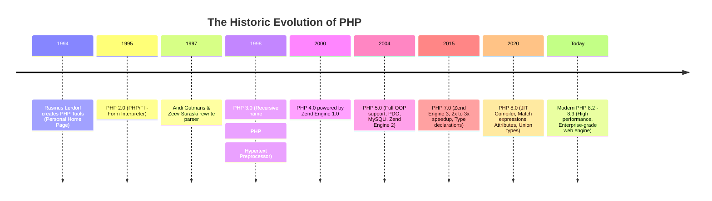
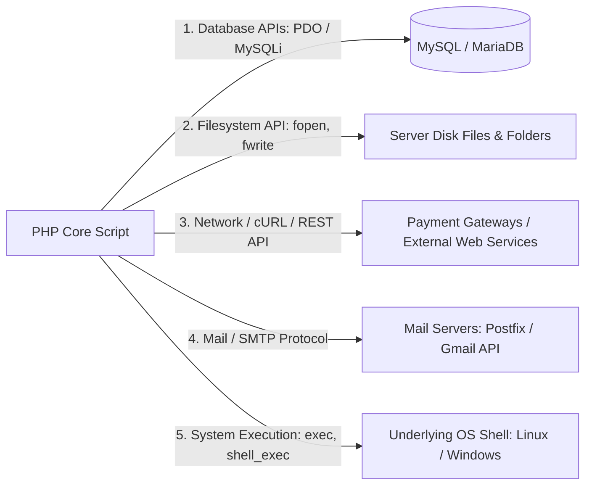
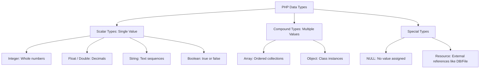
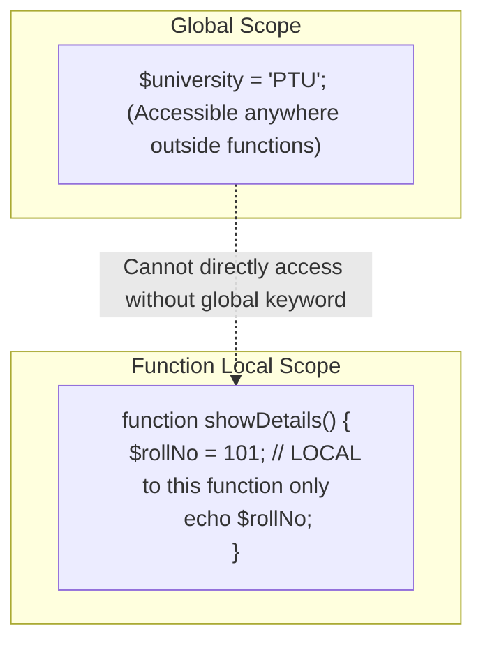

# Unit I: Introduction to PHP
## Complete Bachelor of Computer Applications (BCA) & Computer Science Master Guide

---

### Syllabus Outline (Unit I):
1. **Evolution of PHP and its comparison**
2. **Interfaces to external systems**
3. **Hardware and software requirements**
4. **PHP scripting**
5. **Basic PHP development**
6. **Working of PHP scripts**
7. **Basic PHP syntax**
8. **PHP data types**
9. **Displaying type information**
10. **Testing for a specific data type**
11. **Changing type with settype**
12. **Operators**
13. **Variable manipulation**
14. **Dynamic variables**
15. **Variable scope**

---

## Chapter 1: Evolution of PHP & Comparative Study

### Concept 1.1: What is PHP and How Did It Evolve?
- **Plain English Meaning**: PHP is a powerful computer language designed specifically for building websites. In 1994, a Danish-Canadian programmer named **Rasmus Lerdorf** wanted to know how many people were viewing his online resume. He wrote a small collection of binary programs in the C programming language and called them **"Personal Home Page Tools" (PHP Tools)**.
- **Why It Exists**: In the early 1990s, the web was purely static text and pictures. If you wanted dynamic web pages, you had to write complex programs in C or Perl using CGI (Common Gateway Interface), which was slow, difficult to write, and frequently crashed web servers. PHP was invented to make server-side web scripting simple and directly embeddable within HTML.
- **Where It Is Used Today**: Powering over 75% of all dynamic websites worldwide, including WordPress, Wikipedia, Slack, and major university portals.

#### Key Features of PHP (High-Frequency Exam Question):
1. **Server-Side Execution**: All PHP code executes on the web server; only the resulting HTML output is transmitted to the client's browser.
2. **Seamless HTML Embedding**: PHP tags (`<?php ... ?>`) can be interwoven directly inside HTML templates.
3. **Cross-Platform Compatibility**: Runs identically across Microsoft Windows, Linux, macOS, and UNIX operating systems.
4. **Loosely Typed / Dynamic Typing**: Variable types are bound dynamically at runtime; no need to declare `int` or `float` before assigning variables.
5. **Extensive Native Database Drivers**: Built-in support for MySQL, PostgreSQL, SQLite, Oracle, and MS SQL via PDO.
6. **Cost-Effective & Open-Source**: 100% free under the PHP License with zero licensing fees.

#### Major Advantages of PHP:
- **Zero Licensing Costs**: Free to download, deploy, and host commercially.
- **Gentle Learning Curve**: Easy syntax that borrows familiar conventions from C, Java, and Perl.
- **Instant Edit-and-Test Development Cycle**: No waiting for slow compilation steps; just save the file and refresh your browser.
- **Cheap & Ubiquitous Hosting**: Virtually every web hosting company on earth provides cheap, one-click PHP hosting.
- **Massive Community & Ecosystem**: Millions of packages, libraries, and tutorials available on Packagist/Composer.

#### Drawbacks & Limitations of PHP:
- **Historical Inconsistencies**: Some legacy function names have irregular conventions (e.g., `strlen` vs `str_replace`, `strpos` with parameters vs `in_array`).
- **Dynamic Typing Pitfalls**: In large unmanaged codebases, loose typing can cause unexpected runtime type coercion bugs unless strict typing (`declare(strict_types=1);`) is enabled.
- **Not Suited for Desktop GUI or Machine Learning**: PHP is engineered specifically for web request-response cycles; it is not commonly used for native 3D video games, mobile apps, or heavy mathematical data science.



#### Major Development Milestones:
1. **PHP 1.0 & 2.0 (1994–1995)**: Simple set of C-wrappers called *Personal Home Page / Form Interpreter (PHP/FI)*. Supported simple forms and guestbooks.
2. **PHP 3.0 (1998)**: Re-engineered from scratch by **Andi Gutmans** and **Zeev Suraski** from Tel Aviv. Turned PHP into an extensible programming language with an official recursive acronym: **PHP: Hypertext Preprocessor**.
3. **PHP 4.0 (2000)**: Introduced the **Zend Engine 1.0** (named after **Ze**ev and A**nd**i), adding session handling and output buffering.
4. **PHP 5.0 (2004)**: A massive leap forward. Introduced **Zend Engine 2.0** with complete Object-Oriented Programming (OOP), the `PDO` (PHP Data Objects) abstraction layer, and robust XML parsing.
5. **PHP 7.0 (2015)**: (PHP 6 was skipped due to Unicode refactoring issues). PHP 7 introduced **PHPNG (PHP Next Generation / Zend Engine 3)**, cutting memory consumption in half and doubling execution speed, outperforming early versions of Ruby and Python.
6. **PHP 8.0+ (2020–Present)**: Introduced the **Just-In-Time (JIT) compiler**, Union Types, Named Arguments, Constructor Property Promotion, Attributes, and strict type safety.

---

### Concept 1.2: Comparative Study: PHP vs Other Server-Side Technologies
In university examinations, you will frequently encounter questions asking you to compare PHP with ASP.NET, Java (JSP/Servlets), Python, and Node.js.

| Comparison Parameter | PHP | ASP.NET (Microsoft) | Java (JSP / Spring) | Node.js (JavaScript) |
| :--- | :--- | :--- | :--- | :--- |
| **Licensing / Cost** | 100% Free & Open-Source. | Historically proprietary (now .NET Core is open source). | Free and Open-Source. | Free and Open-Source. |
| **Hosting Cost** | Extremely cheap; available on almost any shared host for ₹100/mo. | Typically requires Windows Server / Azure licenses (higher cost). | Moderate to High (requires specialized JVM containers like Tomcat). | Moderate (requires VPS / cloud droplets like AWS/DigitalOcean). |
| **Learning Curve** | **Very Gentle & Beginner-Friendly.** Can start writing code in 5 minutes. | Moderate; requires understanding of C# and OOP frameworks. | Steep; requires deep knowledge of OOP, JVM, and complex build tools (Maven/Gradle). | Moderate; requires understanding of asynchronous event-loops and promises. |
| **Database Support** | Native, out-of-the-box support for MySQL, PostgreSQL, SQLite via PDO. | Primarily optimized for Microsoft SQL Server. | Broad enterprise support via JDBC. | Requires npm packages (e.g., Mongoose, Sequelize, Prisma). |
| **HTML Integration** | **Directly embedded** into HTML via `<?php ... ?>`. | Uses Razor syntax (`@`) or WebForms. | Uses JSP tags (`<% ... %>`). | Requires templating engines (EJS, Pug) or React/Next frontend. |
| **Target Market** | Small businesses to massive websites (Facebook, Wikipedia, WordPress). | Large corporate enterprises, banks, government systems. | Massive corporate banking and enterprise backends. | Real-time chat applications, streaming APIs, single-page apps. |

- **Exam Definition**: *PHP is an open-source, server-side HTML-embedded scripting language characterized by its rapid deployment, zero licensing costs, native database integration, and gentle learning curve compared to compiled enterprise alternatives.*

---

## Chapter 2: Interfaces to External Systems

### Concept 2.1: How PHP Connects to the Outside World
- **Plain English Meaning**: PHP does not live in an isolated bubble. A complete web application must talk to outside systems: databases, disk storage, mail servers, payment gateways, and operating system utilities.
- **Why It Exists**: To build a real-world software product (like Amazon or a PTU Student Portal), PHP must be able to read files, send SMS/emails, connect to banks, and store data in relational databases.



#### The 5 Primary External System Interfaces in PHP:
1. **Database Interfaces**:
   - **PDO (PHP Data Objects)**: The modern, secure, object-oriented abstraction interface allowing connection to MySQL, PostgreSQL, SQLite, Oracle, and MS SQL with identical function calls.
   - **MySQLi Extension**: Specific interface solely for MySQL databases (supports both procedural and object-oriented paradigms).
2. **Filesystem Interface**: Built-in functions (`fopen`, `fread`, `fwrite`, `unlink`, `scandir`) allowing PHP to manipulate documents, CSV files, and user-uploaded PDF/JPEG files directly on the server's hard drive.
3. **Network & Web Service Interfaces (cURL / HTTP Streams)**:
   - Uses the **cURL** library to send HTTP requests to third-party APIs (e.g., fetching live weather data, verifying Razorpay/Paytm transactions, or verifying Google reCAPTCHA).
4. **Electronic Mail (SMTP Interface)**:
   - Native `mail()` function and libraries like **PHPMailer** interfacing with Simple Mail Transfer Protocol (SMTP) to send admission confirmations and password reset links.
5. **Operating System Interfaces**: Functions like `exec()`, `system()`, and `shell_exec()` that allow authorized PHP scripts to run command-line utilities directly on the host operating system.

---

## Chapter 3: Hardware & Software Requirements

### Concept 3.1: Setting Up the BCA Development Environment
Before a student can practice PHP, their computer must meet basic requirements.

#### 1. Minimum Hardware Requirements (Very modest; almost any PC works):
- **Processor**: Intel Dual Core / Core i3 or AMD equivalent (64-bit architecture recommended).
- **RAM**: Minimum 2 GB (4 GB to 8 GB recommended for comfortable multitasking).
- **Hard Disk Space**: Minimum 2 GB free disk space (for XAMPP, MySQL databases, and IDE).
- **Display**: $1024 \times 768$ minimum resolution.

#### 2. Software Requirements:
1. **Operating System**: Windows 10/11, macOS (10.15+), or Linux (Ubuntu, Fedora, Debian).
2. **Web Server**: Apache HTTP Server 2.4+.
3. **PHP Engine**: PHP 8.1, 8.2, or 8.3.
4. **Database Server**: MySQL 8.0+ or MariaDB 10.4+.
5. **Code Editor / IDE**: Visual Studio Code (VS Code), Sublime Text, or Notepad++.
6. **Web Browser**: Google Chrome, Mozilla Firefox, Microsoft Edge.

#### 3. Step-by-Step Installation Guide (XAMPP):
```text
Step 1: Download XAMPP from https://www.apachefriends.org
Step 2: Run installer (Keep default components: Apache, MySQL, PHP, phpMyAdmin).
Step 3: Choose installation folder (Windows: C:\xampp, Mac: /Applications/XAMPP).
Step 4: Launch the "XAMPP Control Panel".
Step 5: Click the "Start" button next to "Apache" and "MySQL".
Step 6: Both modules should light up green (Apache on Port 80, MySQL on Port 3306).
Step 7: Open your browser and navigate to http://localhost. If the XAMPP dashboard appears, your setup is complete!
```

---

## Chapter 4: PHP Scripting, First Program & File Structure

### Concept 4.1: Your First PHP Program
- **Plain English Meaning**: Let's write the traditional beginner's "Hello World" program.
- **Where to save**:
  - Open your code editor (e.g., VS Code).
  - Create a new file named `hello.php`.
  - Save it inside your Apache root folder: `C:\xampp\htdocs\hello.php`.
  - Open Chrome and type: `http://localhost/hello.php`.

#### The Code:
```php
<?php
// My First PHP Program for 1st Year BCA
echo "Hello World! Welcome to PHP.";
?>
```

#### Line-by-Line Explanation:
1. `<?php`: This is the **Opening PHP Tag**. It signals to the Apache web server and Zend engine: *"Stop treating this text as normal HTML. Switch into PHP execution mode and interpret the following instructions!"*
2. `// My First PHP Program...`: A **single-line comment**. It is completely ignored by the computer. It exists solely to guide human developers.
3. `echo`: A core PHP language construct used to output (print) text, HTML, or variables to the output stream destined for the web browser.
4. `"Hello World! Welcome to PHP."`: A **string literal** (a sequence of characters enclosed in quotation marks).
5. `;`: The **semicolon**. In PHP, the semicolon is an absolute requirement! It tells the interpreter that the current statement has concluded. Omitting a semicolon causes a `Parse Error: syntax error`.
6. `?>`: The **Closing PHP Tag**. It informs the engine that the PHP code block is finished. Any text after this tag will be treated as plain HTML.

#### Expected Browser Output:
```text
Hello World! Welcome to PHP.
```

---

### Concept 4.2: Embedding PHP Inside HTML
- **Plain English Meaning**: PHP was specifically created to blend seamlessly with HTML. You can interleave HTML tags and PHP blocks as many times as you want inside a single file with a `.php` extension.

#### Example:
```html
<!DOCTYPE html>
<html lang="en">
<head>
    <meta charset="UTF-8">
    <title>University BCA - PHP Demo</title>
</head>
<body>
    <h1>Punjab Technical University</h1>
    <p>Current Server Date and Time is: 
        <strong>
            <?php 
                echo date("d-m-Y H:i:s"); 
            ?>
        </strong>
    </p>
</body>
</html>
```

#### How the Server Processes This File:
1. When a browser requests this page, Apache reads the file from top to bottom.
2. The HTML tags (`<!DOCTYPE html>`, `<html>`, `<h1>`) pass through directly untouched.
3. When Apache reaches `<?php`, it executes the `date()` function, producing the string (e.g., `28-09-2026 11:28:00`).
4. That generated date string replaces the `<?php ... ?>` block.
5. The remaining HTML tags (`</p>`, `</body>`, `</html>`) pass through untouched.
6. The browser receives 100% pure HTML.

---

## Chapter 5: Basic PHP Syntax Rules

1. **PHP File Extension**: All files containing PHP code must be saved with the `.php` extension (e.g., `index.php`). If saved as `index.html`, the Apache web server will not pass the file to the PHP interpreter, and the raw `<?php` code will either be displayed or ignored.
2. **Case Sensitivity Rules in PHP (Crucial Exam Concept!)**:
   - **Keywords, Functions, and Class Names are CASE-INSENSITIVE**:
     `echo`, `ECHO`, `Echo`, `if`, `IF`, `strlen()`, and `STRLEN()` are completely identical in PHP.
   - **Variable Names are CASE-SENSITIVE**:
     `$student`, `$Student`, and `$STUDENT` are three completely different variables!
3. **Statements and Semicolons**: Every individual statement in PHP must terminate with a semicolon (`;`). The only exception is the very last statement directly before a closing tag `?>`, where the semicolon is optional (though best practice is to always include it).
4. **Comments in PHP**: Comments are used to document code and are ignored by the PHP engine.
   - **Single-line Comment**: `// This is a comment` or `# This is also a comment`
   - **Multi-line Block Comment**: `/* This comment spans multiple lines */`
5. **Whitespace Independence**: Spaces, tabs, and newlines are ignored outside of strings. You can format your code cleanly with indentation for human readability.

---

## Chapter 6: Variables from Absolute Zero

### Concept 6.1: What is a Variable?
- **Plain English Meaning**: A variable is a named storage container in the computer's temporary memory (RAM) used to hold data values that can be referenced, read, and changed during program execution.
- **Real-World Analogy**: Think of a labeled cardboard storage box in your bedroom. You write the label *"Winter Clothes"* on the box and place two jackets inside. Later, you can remove the jackets and place blankets inside instead. The box name remains the same, but the contents inside can vary. That is why it is called a **variable**.

```text
Memory (RAM)
+-----------------------+
| Variable Name: $age   |
| Memory Address: 0x7FFA|
| Stored Value:   19    |
| Data Type:      int   |
+-----------------------+
```

### Concept 6.2: Variable Naming Rules in PHP (High-Frequency Exam Question)
1. Every variable name **MUST** start with the dollar sign symbol (`$`).
2. Directly after the `$`, the name **must** begin with a **letter** (`a-z`, `A-Z`) or an **underscore** (`_`).
3. A variable name **CANNOT** begin with a number (e.g., `$1student` is invalid; `$student1` is valid).
4. Variable names can only contain alphanumeric characters and underscores (`a-z`, `A-Z`, `0-9`, and `_`). No spaces, dashes, or special punctuation (`$student-name` is illegal; use `$student_name`).
5. Variable names are **case-sensitive** (`$marks` is distinct from `$Marks`).
6. In PHP, you do **not** need to declare variables before assigning them (PHP is **Loosely Typed / Dynamically Typed**).

#### Code Example:
```php
<?php
// Valid Variable Declarations
$name = "Amanpreet Singh";  // String
$age = 19;                   // Integer
$cgpa = 8.75;                // Float
$isEnrolled = true;          // Boolean

echo "Student Name: " . $name . "<br>";
echo "Age: " . $age . " years<br>";
echo "CGPA: " . $cgpa . "<br>";
?>
```

---

## Chapter 7: PHP Data Types

PHP supports **8 primitive data types**, categorized into three groups:



### Comprehensive Data Types Comparison Table:

| Category | Data Type | Description | Example Code | Output |
| :--- | :--- | :--- | :--- | :--- |
| **Scalar** | **Integer** | Non-decimal whole numbers (positive, negative, or zero). | `$rollNo = 101;` | `101` |
| **Scalar** | **Float (Double)**| Numbers containing a decimal point or exponential notation. | `$marks = 89.50;` | `89.5` |
| **Scalar** | **String** | A contiguous sequence of characters enclosed in single or double quotes. | `$city = "Jalandhar";` | `Jalandhar` |
| **Scalar** | **Boolean** | Represents truth values; can only be `true` or `false`. | `$hasPassed = true;` | `1` (or empty for false) |
| **Compound**| **Array** | A single variable holding multiple indexed or keyed values. | `$courses = ["BCA", "B.Tech"];` | Displays array items |
| **Compound**| **Object** | An instance of a user-defined class containing properties and methods. | `$std = new Student();` | Object instance |
| **Special** | **NULL** | A variable with no value assigned, or explicitly set to `null`. | `$scholarship = null;` | Nothing displayed |
| **Special** | **Resource** | Holds an external handler reference (e.g., open file handle, database connection). | `$file = fopen("log.txt","r");`| `Resource id #3` |

#### Complete Data Types Demonstration Script:
```php
<?php
// 1. Integer
$year = 2026;

// 2. Float
$percentage = 92.4;

// 3. String
$college = "University Main Campus";

// 4. Boolean
$isApproved = true;

// 5. Array
$subjects = ["Programming in PHP", "Data Structures", "Mathematics"];

// 6. Object
class University {
    public $name = "Central University";
}
$uni = new University();

// 7. NULL
$resultDate = null;

// 8. Resource (Opening a temporary memory stream)
$handle = fopen("php://memory", "r");

echo "Integer: " . $year . "<br>";
echo "Float: " . $percentage . "<br>";
echo "String: " . $college . "<br>";
echo "Boolean: " . ($isApproved ? "TRUE" : "FALSE") . "<br>";
echo "First Subject: " . $subjects[0] . "<br>";
echo "University Name: " . $uni->name . "<br>";
echo "Is Result Date Null? " . (is_null($resultDate) ? "YES" : "NO") . "<br>";
echo "Resource Type: " . get_resource_type($handle) . "<br>";

fclose($handle);
?>
```

---

## Chapter 8: Displaying & Inspecting Type Information

When writing code or debugging errors, developers must inspect what data type a variable currently holds. PHP provides three essential functions:

### 1. `gettype($variable)`
- Returns a simple string representing the type name: `"integer"`, `"double"`, `"string"`, `"boolean"`, `"array"`, `"object"`, `"NULL"`, or `"resource"`.

### 2. `var_dump($variable)`
- **The developer's best friend!** Dumps full, detailed diagnostic information: the data type, the memory length/size, and the exact value.

### 3. `print_r($variable)`
- Prints human-readable information about a variable. Primarily used to quickly view the keys and values of Arrays and Objects.

#### Comparative Code Example:
```php
<?php
$score = 85.5;
$fruits = ["Apple", "Mango", "Banana"];

// 1. Using gettype()
echo "gettype(\$score): " . gettype($score) . "<br><br>";

// 2. Using var_dump()
echo "var_dump(\$score): ";
var_dump($score);
echo "<br><br>";

echo "var_dump(\$fruits): <br>";
var_dump($fruits);
echo "<br><br>";

// 3. Using print_r()
echo "print_r(\$fruits): <br>";
print_r($fruits);
?>
```

#### Output:
```text
gettype($score): double

var_dump($score): float(85.5)

var_dump($fruits):
array(3) {
  [0]=> string(5) "Apple"
  [1]=> string(5) "Mango"
  [2]=> string(6) "Banana"
}

print_r($fruits):
Array
(
    [0] => Apple
    [1] => Mango
    [2] => Banana
)
```

---

## Chapter 9: Testing for Specific Data Types (`is_*` Functions)

PHP provides built-in boolean validation functions that start with `is_`. They return `true` (1) if the variable matches the requested type, and `false` (empty) otherwise.

| Function | What it Checks | Example | Return Value |
| :--- | :--- | :--- | :--- |
| `is_int($var)` | Is it an integer? | `is_int(42)` | `true` |
| `is_float($var)` | Is it a floating-point number? | `is_float(3.14)` | `true` |
| `is_string($var)` | Is it textual string data? | `is_string("PTU")` | `true` |
| `is_bool($var)` | Is it boolean `true` or `false`? | `is_bool(false)` | `true` |
| `is_array($var)` | Is it an array collection? | `is_array([1,2])` | `true` |
| `is_null($var)` | Is the value explicitly null? | `is_null(null)` | `true` |
| `is_numeric($var)`| Is it a number OR a numeric string? | `is_numeric("500")`| `true` |

#### Practical Code Example:
```php
<?php
function processAdmissionFee($amount) {
    // Check if user input is a valid number before doing arithmetic
    if (is_numeric($amount)) {
        $gst = $amount * 0.18;
        $total = $amount + $gst;
        echo "Base Fee: ₹" . $amount . " | Total Fee with GST: ₹" . $total . "<br>";
    } else {
        echo "Error: Invalid payment amount entered!<br>";
    }
}

processAdmissionFee(5000);    // Valid integer
processAdmissionFee("2500");  // Valid numeric string
processAdmissionFee("Free");  // Non-numeric string -> Triggers Error
?>
```

---

## Chapter 10: Type Conversion & Changing Type with `settype()`

PHP is loosely typed, meaning it automatically converts data types behind the scenes depending on context. However, developers can also forcefully convert types.

### 1. Automatic Type Conversion (Type Juggling)
```php
<?php
$a = "10";     // String
$b = 20;       // Integer
$c = $a + $b;  // PHP automatically converts $a to integer 10, resulting in integer 30
echo "Result: " . $c . " (Type: " . gettype($c) . ")<br>";
?>
```

### 2. Explicit Type Casting (Casting Operators)
You prefix the variable with the target type inside parentheses: `(int)`, `(float)`, `(string)`, `(bool)`, `(array)`.
```php
<?php
$rawInput = "98.6";
$temperature = (int)$rawInput; // Truncates decimal, becomes integer 98
echo "Casted Temperature: " . $temperature . " (Type: " . gettype($temperature) . ")<br>";
?>
```

### 3. Modifying Variable Type Permanently: `settype()`
- **Syntax**: `bool settype(mixed &$var, string $type)`
- **Crucial Distinction**: While casting `(int)$x` returns a new converted value without modifying the original `$x`, `settype($x, "integer")` **directly alters the actual variable in-place**!

#### Line-by-Line Breakdown of `settype()`:
```php
<?php
$value = "100";
echo "Before settype: " . gettype($value) . "<br>"; // string

// Change type to integer permanently
settype($value, "integer");

echo "After settype: " . gettype($value) . "<br>";  // integer
echo "Value: " . $value . "<br>";
?>
```
1. `$value = "100";`: Declares a variable holding the string literal `"100"`.
2. `gettype($value)` returns `"string"`.
3. `settype($value, "integer");`: PHP reconfigures the internal memory structure of `$value`, converting it into an integer.
4. `gettype($value)` now returns `"integer"`.

---

## Chapter 11: Operators in PHP

An **operator** is a mathematical or logical symbol that instructs the PHP interpreter to perform a specific manipulation on one, two, or three operands.

### 1. Arithmetic Operators
Used for standard mathematical calculations.

| Operator | Name | Example | Calculation | Result |
| :--- | :--- | :--- | :--- | :--- |
| `+` | Addition | `10 + 5` | Adds two numbers | `15` |
| `-` | Subtraction | `10 - 5` | Subtracts right from left | `5` |
| `*` | Multiplication | `10 * 5` | Multiplies two numbers | `50` |
| `/` | Division | `10 / 4` | Divides left by right | `2.5` |
| `%` | Modulus (Remainder)| `10 % 3` | Returns integer remainder of division | `1` |
| `**` | Exponentiation | `2 ** 3` | Raises base to the power of exponent ($2^3$) | `8` |

### 2. Assignment Operators
Used to write or update values inside variables.

| Operator | Equivalent To | Description |
| :--- | :--- | :--- |
| `$x = 10` | `$x = 10` | Assigns right-hand value to left-hand variable |
| `$x += 5` | `$x = $x + 5` | Adds 5 to current variable |
| `$x -= 5` | `$x = $x - 5` | Subtracts 5 from current variable |
| `$x *= 5` | `$x = $x * 5` | Multiplies current variable by 5 |
| `$x /= 5` | `$x = $x / 5` | Divides current variable by 5 |
| `$x %= 5` | `$x = $x % 5` | Sets variable to remainder of division by 5 |

### 3. Comparison Operators
Used to compare two expressions. Always evaluates to a boolean (`true` or `false`).

| Operator | Name | Description | Example |
| :--- | :--- | :--- | :--- |
| `==` | Equal (Loose) | True if values are equal after type conversion | `5 == "5"` $\rightarrow$ `true` |
| `===`| **Identical (Strict)**| **True ONLY if values AND data types are identical** | `5 === "5"` $\rightarrow$ `false` |
| `!=` or `<>`| Not Equal | True if values are not equal | `5 != 10` $\rightarrow$ `true` |
| `!==`| Not Identical | True if values OR data types are not identical | `5 !== "5"` $\rightarrow$ `true` |
| `>` | Greater Than | True if left operand is strictly greater | `10 > 5` $\rightarrow$ `true` |
| `<` | Less Than | True if left operand is strictly smaller | `4 < 9` $\rightarrow$ `true` |
| `>=`| Greater or Equal | True if left operand is greater than or equal to right | `5 >= 5` $\rightarrow$ `true` |
| `<=`| Less or Equal | True if left operand is less than or equal to right | `6 <= 10` $\rightarrow$ `true` |
| `<=>`| **Spaceship Operator** | Returns `-1` (if $a < b$), `0` (if $a == b$), `+1` (if $a > b$) | `5 <=> 10` $\rightarrow$ `-1` |

> [!IMPORTANT]
> **University Exam Favorite: Differentiate between `==` and `===`**
> - The `==` (Equality) operator performs automatic type coercion before comparing values (`"10" == 10` is true).
> - The `===` (Strict Identity) operator compares **both** the underlying value and the data type without type conversion (`"10" === 10` is false, because String does not equal Integer).

### 4. Logical Operators & Truth Tables
Used to combine conditional statements.

| Operator | Name | Meaning | Truth Condition |
| :--- | :--- | :--- | :--- |
| `&&` or `and` | Logical AND | Both conditions must be true | True only if $A = \text{true}$ AND $B = \text{true}$ |
| `\|\|` or `or` | Logical OR | At least one condition must be true | True if either $A = \text{true}$ OR $B = \text{true}$ |
| `!` | Logical NOT | Inverts the boolean state | Turns `true` to `false`, and `false` to `true` |
| `xor` | Logical Exclusive OR | Exactly one must be true, but not both | True if $A$ or $B$ is true, but false if both are true |

#### Logical Truth Table:

| Expression A | Expression B | `A && B` (AND) | `A \|\| B` (OR) | `!A` (NOT A) | `A xor B` (XOR) |
| :---: | :---: | :---: | :---: | :---: | :---: |
| `true` | `true` | **`true`** | **`true`** | `false` | `false` |
| `true` | `false`| `false` | **`true`** | `false` | **`true`** |
| `false`| `true` | `false` | **`true`** | `true` | **`true`** |
| `false`| `false`| `false` | `false` | `true` | `false` |

### 5. Increment / Decrement Operators
- `++$x` (Pre-increment): Increments `$x` by 1 first, then returns `$x`.
- `$x++` (Post-increment): Returns current `$x` first, then increments `$x` by 1.
- `--$x` (Pre-decrement): Decrements `$x$ by 1 first, then returns `$x`.
- `$x--` (Post-decrement): Returns current `$x` first, then decrements `$x` by 1.

### 6. String Operators
- `.` (Dot operator): Concatenates (glues) two strings together.
- `.=` (Concatenating assignment): Appends the right-hand string onto the left-hand variable.
```php
<?php
$str1 = "Punjab";
$str2 = "Technical University";
$full = $str1 . " " . $str2; // Result: "Punjab Technical University"

$msg = "Welcome";
$msg .= " Students!";        // Result: "Welcome Students!"
?>
```

---

## Chapter 12: Variable Manipulation Functions

In web applications, user data is often missing, empty, or needs to be cleared from memory. PHP provides three essential functions:

### 1. `isset($var)`
- Returns `true` if the variable has been declared AND its value is not `null`.
- Returns `false` if the variable has not been initialized or is set to `null`.

### 2. `empty($var)`
- Returns `true` if the variable does not exist, or its value evaluates to "falsy": `""` (empty string), `0`, `0.0`, `"0"`, `null`, `false`, or `[]` (empty array).
- Essential for verifying whether a student filled in a required form field!

### 3. `unset($var)`
- Destroys the specified variable, removing it from RAM and unlinking its name.

#### Comparative Code Example:
```php
<?php
$email = "";
$phone = null;
$roll = 101;

// Testing isset()
echo "isset(\$email): " . (isset($email) ? "YES" : "NO") . "<br>"; // YES (exists, even though empty)
echo "isset(\$phone): " . (isset($phone) ? "YES" : "NO") . "<br>"; // NO (null counts as not set)
echo "isset(\$city): "  . (isset($city)  ? "YES" : "NO") . "<br>"; // NO (never declared)

// Testing empty()
echo "empty(\$email): " . (empty($email) ? "YES" : "NO") . "<br>"; // YES (string has length 0)
echo "empty(\$roll): "  . (empty($roll)  ? "YES" : "NO") . "<br>"; // NO (has value 101)

// Testing unset()
unset($roll);
echo "isset(\$roll) after unset: " . (isset($roll) ? "YES" : "NO") . "<br>"; // NO
?>
```

---

## Chapter 13: Dynamic Variables (Variable Variables)

### Concept 13.1: What are Dynamic Variables?
- **Plain English Meaning**: In PHP, you can create a variable whose name is determined dynamically by the *value* of another variable! This is written using two dollar signs: `$$`.
- **Why It Exists**: Allows programs to dynamically construct variable names at runtime based on configuration or form input keys.
- **Real-World Analogy**: Think of a treasure hunt clue. Clue #1 is an envelope that contains the word *"Locker4"*. You then walk over to *Locker4* to retrieve the prize. The first variable pointed you to the name of the second variable!

#### Code Example:
```php
<?php
$item = "course";   // The variable $item contains the string "course"
$$item = "BCA";     // This dynamically creates a variable named $course and sets it to "BCA"

echo "Value of \$item: " . $item . "<br>";       // Prints: course
echo "Value of \$\$item: " . $$item . "<br>";     // Prints: BCA
echo "Direct access to \$course: " . $course . "<br>"; // Prints: BCA
?>
```

#### Line-by-Line Breakdown:
1. `$item = "course";`: Memory creates a variable `$item` storing `"course"`.
2. `$$item = "BCA";`: PHP evaluates `$item` first, which resolves to `"course"`. The statement effectively becomes `$course = "BCA";`.
3. Memory now contains two separate variables: `$item` containing `"course"`, and `$course` containing `"BCA"`.

> [!WARNING]
> **Dynamic Variables vs Arrays**: Beginners often confuse dynamic variables with associative arrays. Dynamic variables create separate variables in the symbol table, which makes code difficult to read, debug, and maintain. In modern software engineering, you should almost always use **Associative Arrays** (`$student['course'] = "BCA"`) instead of dynamic variables!

---

## Chapter 14: Variable Scope (Local, Global, Static)

### Concept 14.1: What is Scope?
- **Plain English Meaning**: **Scope** refers to the specific region or boundary of a program where a declared variable is visible, accessible, and can be used.
- **Why It Exists**: If every variable could be modified from anywhere in a 10,000-line program, a developer working on a student login function could accidentally overwrite a variable used by the marks calculation function. Scope protects variables from unintended interference.



### The Three Variable Scopes in PHP:

#### 1. Local Scope
- A variable declared **inside** a function has local scope.
- It is created the instant the function is called and is immediately destroyed the moment the function finishes running. It cannot be accessed from outside the function.

#### 2. Global Scope
- A variable declared **outside** of all functions has global scope.
- It can be accessed anywhere in the script *outside* functions.
- **Crucial PHP Rule**: Unlike C++ or Java, a global variable is **NOT** automatically visible inside a PHP function! To access a global variable inside a function, you must either:
  1. Use the `global` keyword.
  2. Access the superglobal `$GLOBALS['variable_name']` array.

#### 3. Static Scope
- Normally, when a function completes execution, all of its local variables are wiped from memory.
- If you declare a local variable with the keyword `static`, PHP preserves the variable's value between consecutive calls to that function!

#### Comprehensive Demonstration of All Three Scopes:
```php
<?php
// GLOBAL VARIABLE
$university = "Central University";

function demonstrateScope() {
    // Attempting to access global variable requires 'global' keyword
    global $university;
    
    // LOCAL VARIABLE
    $localMessage = "Welcome to BCA Department";
    
    // STATIC VARIABLE
    static $visitCounter = 0;
    $visitCounter++;
    
    echo "University: " . $university . "<br>";
    echo "Message: " . $localMessage . "<br>";
    echo "Function Call Count: " . $visitCounter . "<br><br>";
}

// Call function three times to observe static counter behavior
demonstrateScope();
demonstrateScope();
demonstrateScope();
?>
```

#### Output:
```text
University: Central University
Message: Welcome to BCA Department
Function Call Count: 1

University: Central University
Message: Welcome to BCA Department
Function Call Count: 2

University: Central University
Message: Welcome to BCA Department
Function Call Count: 3
```

---

## Unit I: Exam Blueprint, Viva Questions & Practice

### High-Probability University Exam Questions:
1. **(10 Marks)**: *What is PHP? Trace the evolution of PHP from version 1.0 to modern PHP. Compare PHP with ASP.NET and Java in detail.*
2. **(5 Marks)**: *Explain the primary data types available in PHP with code examples for each.*
3. **(5 Marks)**: *Differentiate between `gettype()`, `var_dump()`, and `print_r()`.*
4. **(5 Marks)**: *Explain variable scope in PHP with suitable programs demonstrating Local, Global, and Static variables.*
5. **(2 Marks)**: *Explain the purpose of the `settype()` function with syntax.*
6. **(2 Marks)**: *What are dynamic variables in PHP? Give an example.*
7. **(2 Marks)**: *Differentiate between `isset()` and `empty()`.*

### Viva Voce Quick-Fire Prep:
- **Q: What is the recursive meaning of the acronym PHP?**
  - **A**: PHP: Hypertext Preprocessor.
- **Q: What happens if you compare `"100"` and `100` using `==` versus `===`?**
  - **A**: `"100" == 100` evaluates to `true` (values match after type juggling); `"100" === 100` evaluates to `false` (types do not match: String vs Integer).
- **Q: Does PHP require variable declaration with data types like C++ (`int a;`)?**
  - **A**: No, sir. PHP is a loosely typed, dynamically interpreted language. Variables are typed automatically based on the assigned value.
- **Q: How does a `static` variable behave inside a function?**
  - **A**: It retains its value across multiple function calls instead of being reset and destroyed when the function exits.

### Student Practice Exercises:
1. Write a PHP script to store student details (`$name`, `$rollNo`, `$marks1`, `$marks2`, `$marks3`). Calculate the total marks, percentage, and determine if the student passed (passing percentage $\ge 40\%$) using comparison and logical operators.
2. Write a script demonstrating `is_numeric()`, `is_string()`, and `is_float()` by testing four different input variables.
3. Write a program using `$$` dynamic variables to map a state name (`"Punjab"`) to its capital (`"Chandigarh"`).
