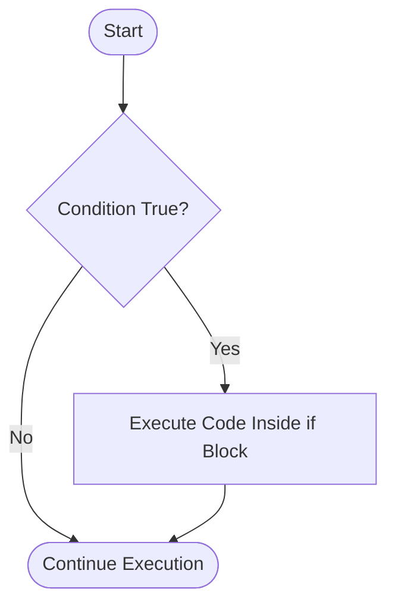
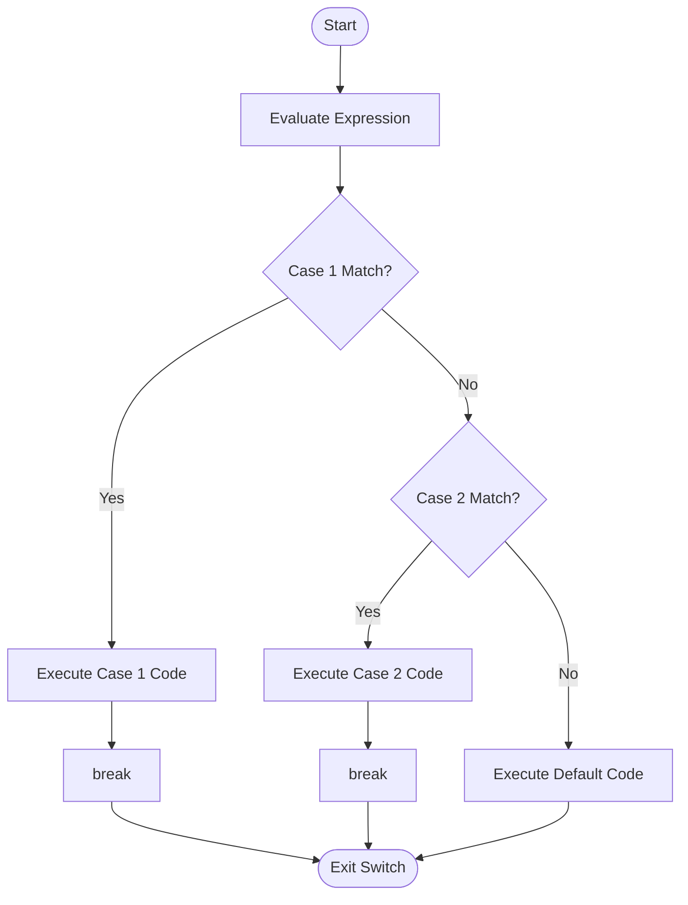
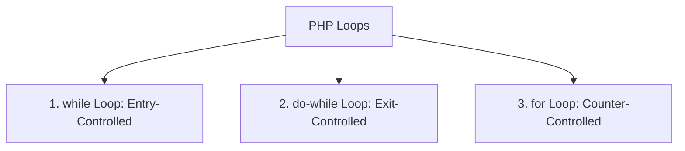
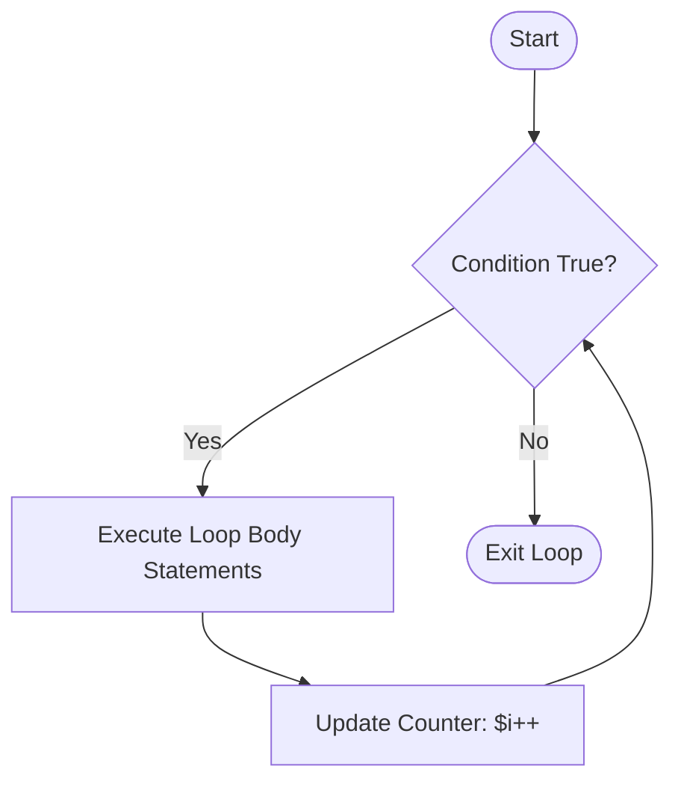
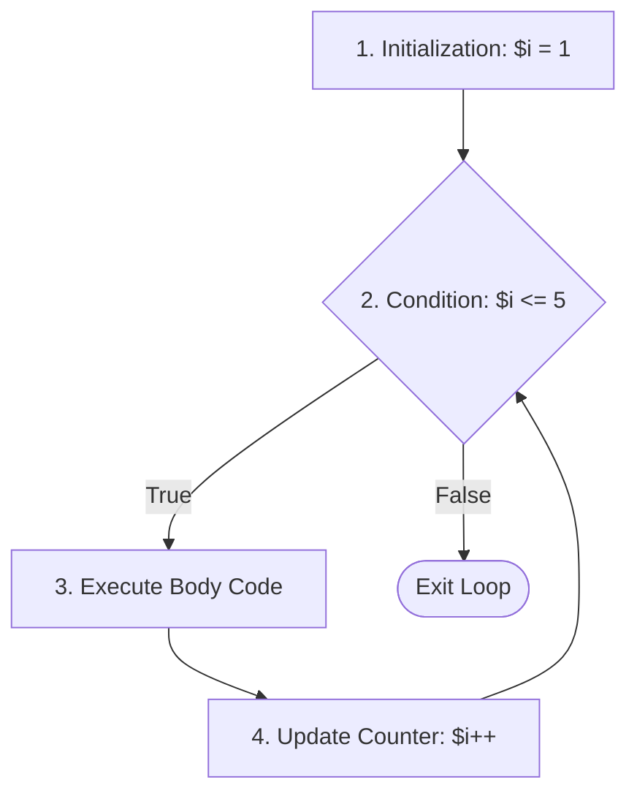
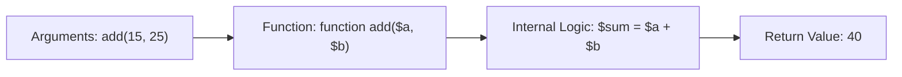
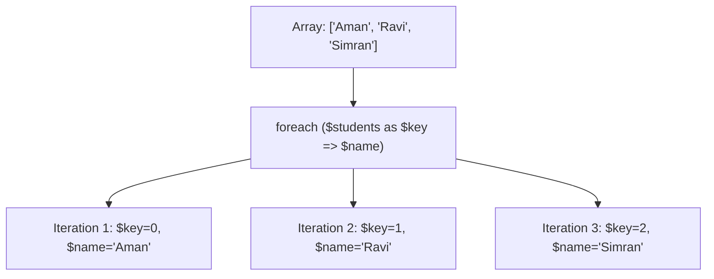

# Unit II: Control Statements, Functions, Strings & Arrays
## BCA 1st Year Master Guide — I.K. Gujral Punjab Technical University (IKGPTU)

---

### Syllabus Outline (Unit II):
1. **Control Statements**: `if()`, `elseif()`, `else`, `switch`, `?:` (Ternary Operator), `while` loop, `do-while` loop, `for` loop.
2. **Functions**: Function definition, function creation, returning values, library functions vs user-defined functions, dynamic functions, default arguments, passing arguments by value.
3. **String Manipulation**: Formatting strings for presentation, formatting strings for storage, joining strings (`implode`), splitting strings (`explode`), comparing strings (`strcmp`, `strcasecmp`, `===`).
4. **Arrays**: Anatomy of an array, creating indexed arrays, creating associative arrays, looping through arrays using `each()` (historical syllabus requirement) and `foreach()` (modern industry standard).

---

## Chapter 1: Control Statements & Decision Making

### Concept 1.1: Why Do We Need Control Statements?
- **Plain English Meaning**: By default, a computer program executes strictly from top to bottom, one line after another (sequential execution). However, real life is full of decisions: *"If today is Sunday, the college is closed; otherwise, attend classes."* Control statements give a program the intelligence to make decisions, execute alternative paths, or repeat instructions based on specified conditions.
- **Real-World Analogy**: A railway track switch. Depending on the signal (condition), the train is diverted onto Track A or Track B.

---

### Concept 1.2: The `if`, `else`, and `elseif` Statements

#### 1. The Simple `if` Statement
- **Syntax**:
  ```php
  if (condition) {
      // Code to execute if condition is true
  }
  ```
- **Execution Flow**: Evaluates the condition. If `true`, the code block runs. If `false`, PHP skips the block entirely.



#### 2. The `if-else` Statement
- **Syntax**:
  ```php
  if (condition) {
      // Code if condition is true
  } else {
      // Code if condition is false
  }
  ```

#### 3. The `if - elseif - else` Ladder (Multi-way Decision)
Used when evaluating multiple mutually exclusive conditions in sequential priority.

#### Comprehensive Marks Grading Example:
```php
<?php
$marks = 78;

if ($marks >= 90) {
    $grade = "A+ (Outstanding)";
} elseif ($marks >= 75) {
    $grade = "A (Distinction)";
} elseif ($marks >= 60) {
    $grade = "B (First Division)";
} elseif ($marks >= 40) {
    $grade = "C (Pass)";
} else {
    $grade = "F (Fail - Reappear Required)";
}

echo "Student Marks: " . $marks . "<br>";
echo "Awarded Grade: " . $grade . "<br>";
?>
```

#### Line-by-Line Explanation:
1. `$marks = 78;`: Initializes variable `$marks` with 78.
2. `if ($marks >= 90)`: Checks if 78 is greater than or equal to 90. Result: `false`. PHP skips to the next `elseif`.
3. `elseif ($marks >= 75)`: Checks if 78 is greater than or equal to 75. Result: `true`!
4. `$grade = "A (Distinction)";`: Executes this assignment.
5. PHP skips all subsequent `elseif` and `else` blocks and jumps straight to the `echo` statements.

---

### Concept 1.3: The `switch` Statement
- **Plain English Meaning**: When you need to test a single variable against many possible discrete values, a long ladder of `if-elseif-elseif` statements becomes cluttered. A `switch` statement provides a clean, organized, multi-branch selection structure.
- **Key Components**:
  - `switch ($expression)`: The variable being tested.
  - `case value:`: A possible matching value.
  - `break;`: **CRITICAL!** Breaks out of the switch block. If you omit `break;`, execution will "fall through" and unintentionally execute all subsequent case blocks!
  - `default:`: Executes if none of the cases match (similar to an `else` block).



#### Practical Switch Example (Course Fee Lookup):
```php
<?php
$course = "BCA";

switch ($course) {
    case "BCA":
        $fee = 35000;
        $duration = "3 Years";
        break;
    case "B.Tech":
        $fee = 65000;
        $duration = "4 Years";
        break;
    case "MCA":
        $fee = 42000;
        $duration = "2 Years";
        break;
    default:
        $fee = 0;
        $duration = "Unknown";
        echo "Error: Unrecognized course selected!<br>";
        break;
}

echo "Selected Course: " . $course . "<br>";
echo "Semester Fee: ₹" . $fee . "<br>";
echo "Program Duration: " . $duration . "<br>";
?>
```

#### Comparison: `switch` vs `if-else`
| Feature | `switch` Statement | `if-elseif-else` Ladder |
| :--- | :--- | :--- |
| **Expression Testing** | Best for testing a single variable for exact equality against discrete constants. | Tests complex boolean expressions involving ranges (`$x > 50 && $x < 100`). |
| **Data Types** | Handles integers, strings, enums. | Handles any boolean-evaluating condition or object. |
| **Readability** | Extremely clean when dealing with 5+ fixed options. | Becomes bulky and hard to read with many branches. |
| **Execution Control** | Requires explicit `break;` to prevent fall-through. | Branches automatically break out once a matching condition executes. |

---

### Concept 1.4: The Ternary Operator (`?:`)
- **Plain English Meaning**: The **ternary operator** is a shorthand, one-line version of a simple `if-else` statement. It is called "ternary" because it takes **three** operands.
- **Syntax**: `condition ? value_if_true : value_if_false;`
- **Real-World Analogy**: An automated turnstile: *Ticket valid? (Yes $\rightarrow$ Open Gate, No $\rightarrow$ Sound Alarm)*.

#### Code Example:
```php
<?php
$age = 19;

// Traditional if-else:
// if ($age >= 18) { $status = "Adult"; } else { $status = "Minor"; }

// Elegant one-line Ternary Operator:
$status = ($age >= 18) ? "Eligible to Vote (Adult)" : "Not Eligible (Minor)";

echo "Age: " . $age . " | Status: " . $status;
?>
```

---

## Chapter 2: Loops (Iteration Statements)

### Concept 2.1: What is a Loop?
- **Plain English Meaning**: A **loop** is a programming construct that repeats a block of code over and over again as long as a specified condition remains true.
- **Why It Exists**: If you need to print roll numbers from 1 to 100, writing 100 separate `echo` statements is tedious, error-prone, and impossible if the count is dynamic. A loop accomplishes this in 3 lines of code.

### The Three Classic Loops in PHP:



---

### Concept 2.2: The `while` Loop (Entry-Controlled Loop)
- **Syntax**:
  ```php
  while (condition) {
      // statements
      // update expression (increment/decrement)
  }
  ```
- **How It Works**: The condition is checked **first** before entering the loop. If the condition is false on the very first try, the loop body **never executes**.



#### Example:
```php
<?php
$count = 1;

while ($count <= 5) {
    echo "Student Roll No: " . $count . "<br>";
    $count++; // Increment counter
}
?>
```

---

### Concept 2.3: The `do-while` Loop (Exit-Controlled Loop)
- **Syntax**:
  ```php
  do {
      // statements
      // update expression
  } while (condition);
  ```
- **How It Works**: The loop body is executed **first**, and the condition is evaluated **at the end**.
- **Crucial Exam Rule**: The body of a `do-while` loop is guaranteed to execute **at least once**, even if the condition is completely false at the start!

#### Example Demonstrating Guaranteed Single Execution:
```php
<?php
$num = 100;

do {
    echo "This line prints even though \$num > 10! Value is: " . $num . "<br>";
    $num++;
} while ($num < 10); // Condition is false from the start!
?>
```

#### Comparison: `while` vs `do-while` (Exam Table)
| Feature | `while` Loop | `do-while` Loop |
| :--- | :--- | :--- |
| **Control Type** | **Entry-controlled** (Pre-test loop). | **Exit-controlled** (Post-test loop). |
| **Condition Check** | Condition is tested **before** entering the loop body. | Condition is tested **after** executing the loop body. |
| **Minimum Executions** | **0 times** (if condition is false initially). | **1 time** (always executes at least once). |
| **Syntax Termination** | No semicolon after `while(condition)`. | **Requires semicolon** after `while(condition);`. |

---

### Concept 2.4: The `for` Loop (Counter-Controlled Loop)
The `for` loop is the most commonly used loop when you know in advance exactly how many times the loop should iterate.

#### Anatomy of a `for` Loop:
```php
for (initialization; test_condition; update_counter) {
    // Loop body statements
}
```



1. **Initialization (`$i = 1`)**: Executes exactly once when the loop starts. Sets the starting counter variable.
2. **Test Condition (`$i <= 5`)**: Checked before every iteration. If `true`, the body executes; if `false`, the loop terminates.
3. **Loop Body**: The statements inside `{}` run.
4. **Update Counter (`$i++`)**: Executes immediately after the loop body finishes. Increments or decrements the counter, then loops back to the test condition.

#### Example (Generating a Mathematical Multiplication Table):
```php
<?php
$tableOf = 7;

echo "<h3>Multiplication Table of " . $tableOf . "</h3>";
for ($i = 1; $i <= 10; $i++) {
    $product = $tableOf * $i;
    echo $tableOf . " x " . $i . " = " . $product . "<br>";
}
?>
```

---

## Chapter 3: Functions in PHP

### Concept 3.1: What is a Function?
- **Plain English Meaning**: A **function** is a self-contained, reusable subprogram block of statements designed to perform a specific task. You write the code once, give it a name, and then "call" (invoke) that name from anywhere in your project whenever you need that task performed.
- **Why It Exists (DRY Principle)**: **Don't Repeat Yourself!** Without functions, if you need to calculate GST in 20 different pages, you would copy-paste the exact same math formulas 20 times. If the tax rate changes, you would have to edit 20 files. With a function, you edit it in one place.
- **Real-World Analogy**: An electric blender in a kitchen. You don't rebuild the motor and blades every time you want juice. You just plug in the blender, put in fruit (parameters), press the button (call function), and pour out the juice (return value).



---

### Concept 3.2: Creating and Calling a Function with Return Values

#### Code Example:
```php
<?php
// 1. Function Definition & Creation
function calculatePercentage($obtainedMarks, $maxMarks) {
    // Local calculation
    $percentage = ($obtainedMarks / $maxMarks) * 100;
    
    // Returning value to caller
    return $percentage;
}

// 2. Calling the Function
$studentObtained = 425;
$totalPossible = 500;

// The returned value is received and stored in $studentResult
$studentResult = calculatePercentage($studentObtained, $totalPossible);

echo "Obtained: " . $studentObtained . " / " . $totalPossible . "<br>";
echo "Calculated Percentage: " . $studentResult . "%<br>";
?>
```

#### Detailed Anatomy Breakdown:
- **`function`**: The keyword signaling that a new function is being declared.
- **`calculatePercentage`**: The function name (identifier).
- **`($obtainedMarks, $maxMarks)`**: **Parameters** (placeholder variables that receive input values).
- **`return $percentage;`**: Sends the final calculated answer back to whoever invoked the function and immediately exits the function.
- **`calculatePercentage(425, 500)`**: The **function call**. The actual values `425` and `500` passed into the function are called **Arguments**.

---

### Concept 3.3: Library Functions vs User-Defined Functions

#### 1. User-Defined Functions
Functions written by you, the application programmer (like `calculatePercentage` or `requireLogin`).

#### 2. Library (Built-In) Functions
Functions built directly into the PHP language engine, ready to use without requiring any manual creation.

#### 7 Essential Built-in Library Functions (High-Frequency Exam Question):
```php
<?php
// 1. strlen() - Returns length of a string
echo "Length of PTU: " . strlen("IKGPTU") . "<br>"; // 6

// 2. strtoupper() - Converts text to uppercase
echo "Uppercase: " . strtoupper("bca semester") . "<br>"; // BCA SEMESTER

// 3. strtolower() - Converts text to lowercase
echo "Lowercase: " . strtolower("ADMIN@PUNJAB.IN") . "<br>"; // admin@punjab.in

// 4. count() - Returns number of elements in an array
$subjects = ["PHP", "DBMS", "OS", "Maths"];
echo "Subject Count: " . count($subjects) . "<br>"; // 4

// 5. date() - Formats server date and time
echo "Today's Date: " . date("d-M-Y") . "<br>"; // e.g., 28-Sep-2026

// 6. round() - Rounds float to nearest integer or decimal places
echo "Rounded: " . round(84.678, 2) . "<br>"; // 84.68

// 7. abs() - Returns absolute (positive) value of a number
echo "Absolute Value: " . abs(-45) . "<br>"; // 45
?>
```

---

### Concept 3.4: Default Arguments in Functions
- **Plain English Meaning**: You can assign a fallback default value to a function parameter. If the caller does not pass an argument for that parameter, PHP automatically uses the default value.

```php
<?php
function greetStudent($name, $course = "BCA") {
    return "Hello, " . $name . "! Welcome to the " . $course . " department.<br>";
}

// Calling with both arguments:
echo greetStudent("Aman", "MCA"); // Uses passed value "MCA"

// Calling with only one argument:
echo greetStudent("Simran");        // Uses default value "BCA"
?>
```

---

### Concept 3.5: Passing Arguments by Value
- **Plain English Meaning**: By default in PHP, arguments are passed to functions **by value**. This means PHP creates an independent **copy** of the variable's value and passes that copy into the function.
- **Crucial Rule**: Any changes made to the parameter *inside* the function do **not** affect or change the original variable outside the function!

```text
Global Memory:
$score = 50  -------------------------+
                                      | (Copies value 50)
                                      v
Function Local Memory:
$x = 50 ---> $x += 20 ---> $x is now 70
(Function exits and $x is destroyed)

Back in Global Memory:
$score is STILL 50!
```

#### Code Demonstration:
```php
<?php
function addBonusMarks($x) {
    $x = $x + 15; // Modifies the local copy only
    echo "Inside Function: \$x = " . $x . "<br>";
}

$studentMarks = 60;
echo "Before Function Call: \$studentMarks = " . $studentMarks . "<br>";

addBonusMarks($studentMarks);

echo "After Function Call: \$studentMarks = " . $studentMarks . "<br>";
?>
```

#### Output:
```text
Before Function Call: $studentMarks = 60
Inside Function: $x = 75
After Function Call: $studentMarks = 60
```

---

### Concept 3.6: Dynamic Functions (Variable Functions)
- **Plain English Meaning**: In PHP, if you append parentheses `()` to a variable, PHP looks for a function whose name matches the string stored inside that variable and executes it!
- **Syllabus Context vs Modern Practice**:
  - **Syllabus Theory**: PHP allows dynamic function invocation via variable functions: `$func = "welcome"; $func();`.
  - **Modern PHP Practice**: Modern PHP 8+ supports Anonymous Functions (Closures), Arrow Functions (`fn($x) => $x * 2`), and First-Class Callables (`$func = strlen(...)`).

#### Code Example:
```php
<?php
function sendEmailNotification() {
    return "Email notification sent to student successfully!";
}

function sendSmsNotification() {
    return "SMS text alert dispatched to student mobile!";
}

// The user or system decides the notification channel dynamically
$channel = "sendEmailNotification";

// Dynamic Function Call:
echo $channel() . "<br>"; // Executes sendEmailNotification()

$channel = "sendSmsNotification";
echo $channel() . "<br>"; // Executes sendSmsNotification()
?>
```

---

## Chapter 4: String Manipulation

A **string** is an ordered sequence of binary characters (letters, numbers, spaces, symbols) treated as text.

### Concept 4.1: Single Quotes vs Double Quotes (High-Frequency Exam Question)
- **Single Quotes (`'...'`)**: Literal strings. Variables inside single quotes are **NOT** evaluated; they are printed literally as characters.
- **Double Quotes (`"..."`)**: Interpolated strings. PHP parses variables and special escape sequences (`\n`, `\t`) inside double quotes and substitutes their values.

```php
<?php
$name = "Aman";

echo 'Hello $name <br>'; // Prints literally: Hello $name
echo "Hello $name <br>"; // Prints: Hello Aman
?>
```

---

### Concept 4.2: Formatting Strings for Presentation
When displaying data to humans on a webpage, raw database data must be formatted cleanly.

```php
<?php
// 1. number_format() - Adds commas and sets decimal precision for currency
$price = 1250000.75;
echo "Formatted Price: ₹" . number_format($price, 2) . "<br>"; // ₹1,250,000.75

// 2. printf() and sprintf() - Formatted printing using specifiers (%s, %d, %0.2f)
$cgpa = 8.6;
$msg = sprintf("Student %s has achieved a CGPA of %.2f", "Rohan", $cgpa);
echo $msg . "<br>";

// 3. nl2br() - Converts newline characters (\n) to HTML <br> tags
$feedback = "Great course.\nReally enjoyed PHP.";
echo nl2br($feedback) . "<br>";

// 4. htmlspecialchars() - Converts HTML special characters (<, >, &, ") to safe entities
// CRITICAL FOR PREVENTING XSS ATTACKS!
$rawInput = "<script>alert('Hacked!');</script>";
echo htmlspecialchars($rawInput) . "<br>";
?>
```

---

### Concept 4.3: Formatting Strings for Storage
Before saving user input into a MySQL database, strings must be sanitized and normalized.

```php
<?php
// 1. trim() - Strips accidental leading and trailing whitespace
$rawEmail = "   student@ptu.ac.in   ";
$cleanEmail = trim($rawEmail); // "student@ptu.ac.in"

// 2. strtolower() - Standardizes emails to lowercase to prevent duplicates
$normalizedEmail = strtolower($cleanEmail);

// 3. addslashes() and stripslashes() - Escapes quotes with backslashes
$comment = "Student's project is ready";
$escaped = addslashes($comment); // "Student\'s project is ready"
$restored = stripslashes($escaped); // "Student's project is ready"

echo "Clean Email: " . $normalizedEmail . "<br>";
?>
```

---

### Concept 4.4: Joining Strings (`implode`) and Splitting Strings (`explode`)
These two reciprocal functions are among the most frequently tested in university practicals.

#### 1. `explode(separator, string)`: Splits a string into an Array.
- **Real-World Analogy**: Taking a necklace and snipping the string between each bead so the beads separate.

#### 2. `implode(separator, array)`: Joins an Array of elements into a single String.
- **Real-World Analogy**: Threading loose beads onto a string to make a necklace.

```php
<?php
// SPLITTING: String to Array using explode()
$hobbiesString = "Cricket,Reading,Coding,Chess";
$hobbiesArray = explode(",", $hobbiesString);

echo "Array after explode:<br>";
print_r($hobbiesArray);
echo "<br><br>";

// JOINING: Array to String using implode()
$skills = ["PHP", "MySQL", "Apache", "HTML5"];
$skillsString = implode(" | ", $skills);

echo "String after implode: " . $skillsString . "<br>";
?>
```

#### Output:
```text
Array after explode:
Array ( [0] => Cricket [1] => Reading [2] => Coding [3] => Chess )

String after implode: PHP | MySQL | Apache | HTML5
```

---

### Concept 4.5: Comparing Strings
- **`strcmp($str1, $str2)`**: Binary safe string comparison. **Case-sensitive**.
  - Returns `0` if strings are exactly equal.
  - Returns `< 0` if `$str1` is less than `$str2`.
  - Returns `> 0` if `$str1` is greater than `$str2`.
- **`strcasecmp($str1, $str2)`**: Case-**insensitive** string comparison.
- **`===`**: Identity operator. Fast and clean for equality checks.

```php
<?php
$strA = "Punjab";
$strB = "punjab";

// Case-sensitive comparison
if (strcmp($strA, $strB) === 0) {
    echo "strcmp: Strings are identical.<br>";
} else {
    echo "strcmp: Strings are DIFFERENT due to uppercase 'P'.<br>";
}

// Case-insensitive comparison
if (strcasecmp($strA, $strB) === 0) {
    echo "strcasecmp: Strings MATCH (ignoring case)!<br>";
}
?>
```

---

## Chapter 5: Arrays in PHP

### Concept 5.1: Anatomy of an Array
- **Plain English Meaning**: A normal variable holds exactly one value at a time (`$score = 80`). An **array** is a specialized compound data structure that can hold **multiple values** under a single variable name.
- **Key-Value Pairs**: Every single element inside an array consists of two parts:
  1. A **Key** (also called an Index or label used to look up the item).
  2. A **Value** (the actual data stored at that key).

```text
Indexed Array:
Index (Key):    [0]          [1]          [2]
Value:       ["Aman"]     ["Ravi"]     ["Simran"]

Associative Array:
Key:        ["name"]     ["roll"]     ["course"]
Value:       "Aman"        101          "BCA"
```

---

### Concept 5.2: Indexed Arrays (Numeric Keys)
In an indexed array, keys are automatically assigned non-negative integers starting at `0` (Zero-Based Indexing).

```php
<?php
// Creating an indexed array (Modern shorthand [] or traditional array())
$students = ["Aman", "Ravi", "Simran", "Pooja"];

// Accessing elements by index
echo "First Student: " . $students[0] . "<br>"; // Aman
echo "Second Student: " . $students[1] . "<br>"; // Ravi

// Modifying an element
$students[1] = "Ravinder";

// Appending a new element to the end
$students[] = "Gurpreet"; // Automatically gets index [4]

// Built-in Array Helper Functions
echo "Total Students: " . count($students) . "<br>";

// Sorting indexed array in ascending order
sort($students);

// array_push() and array_pop()
array_push($students, "Harpreet"); // Adds to end
$removed = array_pop($students);   // Removes last item ("Harpreet")
?>
```

---

### Concept 5.3: Associative Arrays (Named Keys)
- **Plain English Meaning**: Instead of boring numeric indexes (`0, 1, 2`), an **associative array** uses named, meaningful strings as keys!
- **Why It Exists**: Storing a student record as `$student[0] = "Aman"` and `$student[1] = 19` is confusing because you must remember what index 1 represents. An associative array allows `$student["name"] = "Aman"` and `$student["age"] = 19`, making the code self-documenting.

```php
<?php
// Creating an associative array
$student = [
    "roll_no"  => 101,
    "name"     => "Amanpreet Singh",
    "course"   => "BCA",
    "semester" => 1,
    "cgpa"     => 8.90
];

// Accessing values using string keys
echo "Roll No: " . $student["roll_no"] . "<br>";
echo "Name: " . $student["name"] . "<br>";
echo "Course: " . $student["course"] . "<br>";

// Modifying values
$student["semester"] = 2;

// Adding a new key-value pair
$student["email"] = "aman@ptu.ac.in";
?>
```

---

### Concept 5.4: Looping Through Arrays: `foreach()` and Historical `each()`

#### 1. The Modern Gold Standard: `foreach()`
`foreach` is specifically designed for traversing arrays easily without needing to manage loop counter variables or knowing the array size.



```php
<?php
$student = [
    "Roll No"  => 101,
    "Name"     => "Amanpreet Singh",
    "Course"   => "BCA",
    "College"  => "IKGPTU Campus"
];

echo "<h4>Student Profile</h4>";
echo "<ul>";
// Traversing both Key and Value
foreach ($student as $label => $val) {
    echo "<li><strong>" . $label . ":</strong> " . $val . "</li>";
}
echo "</ul>";
?>
```

---

### Concept 5.5: The Historical `each()` Function (Syllabus Requirement Explained)

> [!CAUTION]
> **IKGPTU Syllabus Historical Context Alert**:
> The syllabus specifically lists `each()`. However, every BCA student must know the following crucial facts:
> 1. In PHP 4, 5, and early PHP 7, `each()` was an internal function that returned the current key-value pair of an array and advanced the internal array pointer. It was commonly paired with `list()` in a `while` loop: `while (list($key, $val) = each($array))`.
> 2. **DEPRECATION & REMOVAL**: `each()` was deprecated in PHP 7.2 and **completely REMOVED in PHP 8.0** because it was slow, caused subtle pointer bugs, and was totally redundant with `foreach()`.
> 3. **Exam Strategy**: In your theory exam, write the historical syntax of `each()` to satisfy the syllabus question, but explicitly add a note stating: *"Note: `each()` has been removed in modern PHP 8; `foreach()` is the official replacement."*

#### Historical Syntax of `each()`:
```php
// HISTORICAL SYNTAX (PHP 5 / 7.0 ONLY - DO NOT RUN IN PHP 8)
$courses = ["BCA", "MCA", "B.Tech"];

// How programmers looped before foreach became universal:
reset($courses); // Reset internal pointer to beginning
while ($element = each($courses)) {
    // $element was an array containing keys: 0, 1, 'key', 'value'
    echo "Key: " . $element['key'] . " | Value: " . $element['value'] . "<br>";
}
```

#### Modern Equivalent (What to write and use today):
```php
// MODERN STANDARD (PHP 7 & 8)
$courses = ["BCA", "MCA", "B.Tech"];
foreach ($courses as $key => $value) {
    echo "Key: " . $key . " | Value: " . $value . "<br>";
}
```

---

## Unit II: Exam Blueprint, Viva Questions & Practice

### High-Probability University Exam Questions:
1. **(10 Marks)**: *Explain control statements in PHP. Differentiate between `while` and `do-while` loops with flowcharts and code examples.*
2. **(10 Marks)**: *What is an array in PHP? Differentiate between Indexed and Associative arrays. Explain how to traverse arrays using `foreach()`.*
3. **(5 Marks)**: *Explain the concept of User-Defined Functions. Explain passing arguments by value with a memory diagram.*
4. **(5 Marks)**: *Explain string manipulation functions: `explode()`, `implode()`, `strcmp()`, and `trim()`.*
5. **(2 Marks)**: *What is the difference between single quotes and double quotes in PHP?*
6. **(2 Marks)**: *Why is the `break` statement used in a `switch` statement? What is fall-through?*
7. **(2 Marks)**: *What was the purpose of `each()` and why is it removed from modern PHP?*

### Viva Voce Quick-Fire Prep:
- **Q: Which loop guarantees at least one execution of its body?**
  - **A**: The `do-while` loop, sir, because it is an exit-controlled loop that tests the condition at the end.
- **Q: What does the `explode()` function return?**
  - **A**: It splits a string by a delimiter and returns an **Array**.
- **Q: If I pass a variable into a function, does the function permanently change my original variable?**
  - **A**: No, sir. PHP passes arguments by value by default. The function works on a separate copy in local memory.
- **Q: What happens if you forget to put a `break;` statement in a `switch` case?**
  - **A**: The program falls through and executes the code of subsequent cases until it finds a `break` or hits the end of the switch block.

### Student Practice Exercises:
1. Write a PHP program to print the Fibonacci series up to 10 terms using a `for` loop.
2. Create an associative array storing 5 students with their percentage marks. Use `foreach` to find and print the name of the class topper.
3. Write a function `checkPrime($number)` that returns `true` if a number is prime and `false` otherwise. Test it with numbers from 1 to 20.
