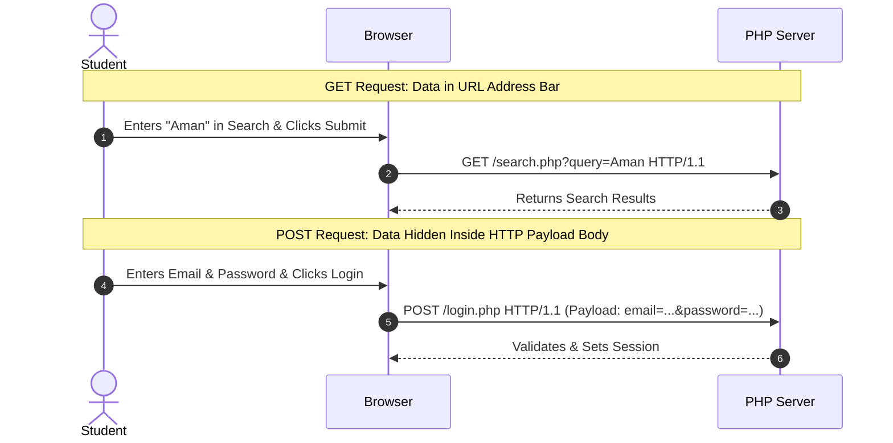
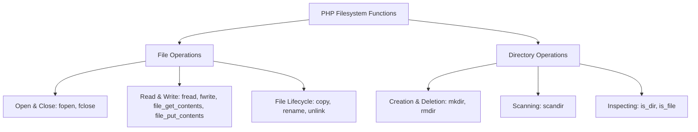
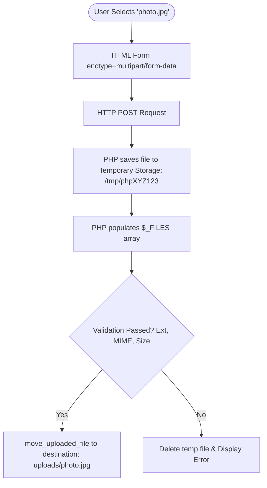

# Unit III: Forms, Files, Directories & Image Generation
## BCA 1st Year Master Guide — I.K. Gujral Punjab Technical University (IKGPTU)

---

### Syllabus Outline (Unit III):
1. **Forms**: Working with forms, Superglobal variables and arrays, Importing user input, Accessing user input, Combining HTML and PHP code, Hidden fields, Redirecting the user.
2. **Working with Files and Directories**: Understanding files and directories, Opening files, Closing files, Copying files, Renaming files, Deleting files, Working with directories, File uploading, File downloading.
3. **Generating Images with PHP**: Basics of computer graphics, Creating images using PHP (GD Library).

---

## Chapter 1: Working with HTML Forms & PHP Integration

### Concept 1.1: What is a Web Form?
- **Plain English Meaning**: An HTML form is an interactive graphical interface on a web page that allows human visitors to enter information (such as text, numbers, dates, passwords, or files) and send that data to the web server for processing.
- **Why It Exists**: Websites cannot be interactive without two-way communication. A form is the bridge between human intention and server-side processing.

### The Essential HTML Form Controls:
- `<form>`: The wrapper container defining where (`action`) and how (`method`) the data is sent.
- `<label>`: A text caption that improves accessibility and UX.
- `<input type="text">`: Single-line text input (e.g., student name).
- `<input type="email">`: Email input with automatic browser-side format validation.
- `<input type="password">`: Masks entered characters as dots or asterisks for privacy.
- `<input type="number">`: Restricts input to numeric digits.
- `<input type="radio">`: Radio buttons allowing the user to select exactly ONE option from a group (e.g., Gender: Male/Female).
- `<input type="checkbox">`: Ticking boxes allowing multiple selections (e.g., Hobbies).
- `<textarea>`: Multi-line text input box (e.g., permanent address or comments).
- `<select>` & `<option>`: Dropdown menu list (e.g., Course selection).
- `<button type="submit">`: Triggers the form submission.

---

### Concept 1.2: The Two Transmission Methods: GET vs POST
When a form is submitted, the browser packages the inputs into an HTTP request. You must specify whether to use the **GET** method or the **POST** method.



#### Detailed Comparison Table: GET vs POST (High-Frequency Exam Question)

| Comparison Parameter | HTTP GET Method | HTTP POST Method |
| :--- | :--- | :--- |
| **Data Visibility** | Data parameters are appended directly onto the URL query string (`page.php?id=10&name=Aman`). | Data is sent invisibly inside the body of the HTTP request payload. |
| **Security** | **Completely insecure for sensitive data.** Passwords and credit cards appear in plain text in browser history and server logs. | **Much more secure.** Sensitive data is not displayed in the address bar or saved in browser history. |
| **Data Length Limit** | Strict limit (approximately 2,048 characters depending on browser/server URL limits). | Virtually unlimited (configurable via `post_max_size` in `php.ini`, typically 8MB - 64MB). |
| **File Upload Support**| **Cannot be used for file uploads.** | **Required for file and image uploads** (`multipart/form-data`). |
| **Bookmarkability** | Can be bookmarked and shared easily via URL (ideal for search queries and page numbers). | Cannot be bookmarked directly. Reloading prompts a warning: *"Confirm Form Resubmission"*. |
| **Idempotency** | Idempotent (requesting 10 times does not change server state). | Non-idempotent (submitting 10 times could insert 10 duplicate records). |
| **Typical Use-Cases** | Search engines, pagination, filtering products by price, viewing a profile by ID. | User login, registration, payment checkout, deleting records, uploading photos. |

---

### Concept 1.3: PHP Superglobals (The 9 Built-In Superglobal Arrays)

- **Plain English Meaning**: In PHP, **Superglobals** are pre-defined, built-in global arrays that are automatically available in every single scope throughout your entire script—inside functions, classes, and included files—without needing the `global` keyword!
- **Why They Exist**: They provide an organized, standardized mechanism for PHP to access incoming HTTP request headers, form data, cookie values, active user sessions, and server environment variables.

#### The Complete Superglobals Reference Table:

| Superglobal Array | Description & Purpose | Typical Real-World BCA Use Case |
| :--- | :--- | :--- |
| **`$_GET`** | Associative array of variables passed via URL query strings or GET forms. | Reading search keywords: `$_GET['search']`. |
| **`$_POST`** | Associative array of variables sent via HTTP POST forms. | Capturing login credentials: `$_POST['password']`. |
| **`$_REQUEST`** | Combined array containing contents of `$_GET`, `$_POST`, and `$_COOKIE`. | Convenient, but avoided in secure code due to ambiguity. |
| **`$_SERVER`** | Contains headers, file paths, script locations, and client IP info. | Checking request method: `$_SERVER['REQUEST_METHOD'] === 'POST'`. |
| **`$_SESSION`** | Stores session variables persistent across multiple page requests. | Storing authenticated user ID: `$_SESSION['user_id']`. |
| **`$_COOKIE`** | Associative array of variables passed via HTTP Cookies stored on the client. | Remembering theme preference: `$_COOKIE['theme']`. |
| **`$_FILES`** | Contains items uploaded via POST forms with `multipart/form-data`. | Reading uploaded student photo: `$_FILES['photo']['name']`. |
| **`$_ENV`** | Environment variables passed to PHP from the server operating system. | Reading database connection secrets or API keys. |
| **`$GLOBALS`** | References all variables available in global scope of the script. | Accessing a global variable inside a function without `global`. |

---

### Concept 1.4: Accessing and Sanitizing User Input Safely
> [!CAUTION]
> **Golden Rule of Web Security**: **NEVER TRUST USER INPUT!**
> Users can type malicious JavaScript into form fields (leading to Cross-Site Scripting, or XSS) or craft malicious SQL strings (leading to SQL Injection). Every single input from `$_POST` and `$_GET` must be cleaned and validated!

#### Sanitization Tools:
1. **`trim($string)`**: Strips accidental leading/trailing spaces.
2. **`htmlspecialchars($string, ENT_QUOTES, 'UTF-8')`**: Converts special characters like `<` and `>` into HTML entities (`&lt;` and `&gt;`). This prevents attackers from injecting `<script>` tags that run in other users' browsers.
3. **`filter_input()`**: Built-in PHP filter for validating emails, URLs, and integers.

#### Complete Self-Processing Form Example:
```php
<?php
// Initialize variables to hold input and error messages
$name = "";
$email = "";
$errors = [];
$successMessage = "";

// Check if the form was submitted via POST
if ($_SERVER["REQUEST_METHOD"] === "POST") {
    
    // 1. Sanitize string input
    $name = trim($_POST["student_name"] ?? "");
    $email = trim($_POST["student_email"] ?? "");

    // 2. Validate student name
    if (empty($name)) {
        $errors[] = "Student Name is required.";
    } elseif (strlen($name) < 3) {
        $errors[] = "Student Name must be at least 3 characters long.";
    }

    // 3. Validate student email using PHP filter
    if (empty($email)) {
        $errors[] = "Email address is required.";
    } elseif (!filter_var($email, FILTER_VALIDATE_EMAIL)) {
        $errors[] = "Please enter a valid email address.";
    }

    // 4. If there are no validation errors, process the data
    if (empty($errors)) {
        // Safe to store in database or display
        $successMessage = "Registration successful for " . htmlspecialchars($name) . "!";
        // Reset form fields
        $name = "";
        $email = "";
    }
}
?>

<!DOCTYPE html>
<html lang="en">
<head>
    <meta charset="UTF-8">
    <title>Student Registration Form</title>
    <style>
        .error { color: red; font-size: 14px; }
        .success { color: green; font-weight: bold; }
    </style>
</head>
<body>

    <h2>BCA Student Registration</h2>

    <?php if (!empty($successMessage)): ?>
        <p class="success"><?php echo $successMessage; ?></p>
    <?php endif; ?>

    <?php if (!empty($errors)): ?>
        <ul class="error">
            <?php foreach ($errors as $err): ?>
                <li><?php echo $err; ?></li>
            <?php endforeach; ?>
        </ul>
    <?php endif; ?>

    <!-- Form posts back to the same script securely -->
    <form method="POST" action="<?php echo htmlspecialchars($_SERVER['PHP_SELF']); ?>">
        <div>
            <label for="name">Student Full Name:</label><br>
            <input type="text" id="name" name="student_name" value="<?php echo htmlspecialchars($name); ?>">
        </div>
        <br>
        <div>
            <label for="email">College Email ID:</label><br>
            <input type="email" id="email" name="student_email" value="<?php echo htmlspecialchars($email); ?>">
        </div>
        <br>
        <button type="submit">Submit Registration</button>
    </form>

</body>
</html>
```

---

### Concept 1.5: Hidden Form Fields (`<input type="hidden">`)
- **Plain English Meaning**: An `<input type="hidden">` is an HTML form element that is invisible on the web page. The user cannot see or interact with it on the screen, but when the form is submitted, its name and value are sent to the server along with the other inputs.
- **Where It Is Used**:
  1. Passing record IDs during updates or deletions (e.g., `<input type="hidden" name="student_id" value="105">`).
  2. Passing CSRF (Cross-Site Request Forgery) security verification tokens.
- **Crucial Security Warning**: **Hidden fields are NOT secret!** Any user can right-click, choose "Inspect Element" in Chrome, and change `value="105"` to `value="200"`. Never store prices or administrative privilege flags in hidden fields without verifying them on the server!

---

### Concept 1.6: Redirecting the User: `header("Location: ...")`
- **Plain English Meaning**: After processing a form (e.g., logging in or deleting a record), you often want to send the user to a different page (such as `dashboard.php`). In PHP, this is accomplished using the `header()` function to issue an HTTP `302 Found` redirection code.
- **The Golden Rule of HTTP Headers**: `header()` sends raw HTTP headers over the network. HTTP headers **MUST** be transmitted to the browser **BEFORE** any actual HTML, text, or whitespace is printed! If you echo even a single space or letter before calling `header()`, PHP will throw a fatal error: `Warning: Cannot modify header information - headers already sent`.
- **Always Call `exit()` or `die()` After Redirection**: Calling `header("Location: ...")` instructs the browser to redirect, but the PHP interpreter on the server will continue executing the rest of the script underneath unless explicitly told to stop!

```php
<?php
// Correct redirection pattern
$isUserLoggedIn = true;

if (!$isUserLoggedIn) {
    // Redirect to login page and immediately terminate script execution
    header("Location: login.php");
    exit(); 
}
?>
```

---

## Chapter 2: Working with Files & Directories

In modern web development, servers frequently need to create activity logs, read CSV files, write reports, store uploaded assignments, and organize media folders.



### Concept 2.1: Opening, Reading, Writing, and Closing Files

#### 1. File Modes in `fopen($filename, $mode)`:
- `'r'`: Read-only. Pointer starts at the beginning of the file.
- `'w'`: Write-only. Erases (truncates) the file contents to zero length! If file does not exist, creates it.
- `'a'`: Append-only. Writes data at the very end of the file. If file does not exist, creates it.
- `'r+'`: Read and Write.
- `'w+'`: Read and Write (erases existing content).
- `'a+'`: Read and Append.

#### Complete File Read/Write Example:
```php
<?php
$logFilePath = "student_access.log";

// 1. WRITING / APPENDING TO A FILE
$fileHandle = fopen($logFilePath, "a"); // Open in Append mode

if ($fileHandle === false) {
    die("Error: Unable to open or create file for writing!");
}

$logMessage = "[" . date("Y-m-d H:i:s") . "] Student Amanpreet logged in.\n";
fwrite($fileHandle, $logMessage); // Write string to disk

fclose($fileHandle); // Always close the open resource handle!

// 2. READING THE FILE LINE BY LINE
$readHandle = fopen($logFilePath, "r");

echo "<h4>Log File Entries:</h4>";
while (!feof($readHandle)) { // feof: Checks if End-Of-File has been reached
    $line = fgets($readHandle); // Reads a single line
    echo htmlspecialchars($line) . "<br>";
}

fclose($readHandle);
?>
```

---

### Concept 2.2: Modern File Helpers: `file_get_contents()` & `file_put_contents()`
For 90% of everyday tasks, manually managing `fopen()`, `fread()`, and `fclose()` is unnecessary. Modern PHP provides two clean helper functions:

```php
<?php
$file = "notice.txt";

// Write an entire string to disk in one clean statement:
file_put_contents($file, "Exams will commence from 15th December 2026.");

// Read an entire file into a string variable in one clean statement:
$content = file_get_contents($file);
echo "Notice Board Content: " . $content;
?>
```

---

### Concept 2.3: File Lifecycle Operations: `copy()`, `rename()`, `unlink()`

```php
<?php
$original = "student_marks.txt";
$backup = "student_marks_backup.txt";
$renamed = "marks_2026.txt";

// 1. Copying a file
if (file_exists($original)) {
    copy($original, $backup);
    echo "Backup created successfully.<br>";
}

// 2. Renaming a file
if (file_exists($backup)) {
    rename($backup, $renamed);
    echo "File renamed to " . $renamed . "<br>";
}

// 3. Deleting a file (unlink)
if (file_exists($renamed)) {
    unlink($renamed); // Deletes file from hard drive
    echo "File " . $renamed . " deleted successfully.<br>";
}
?>
```

---

### Concept 2.4: Working with Directories (Folders)
- **`mkdir($path)`**: Creates a new folder.
- **`rmdir($path)`**: Deletes an **empty** directory.
- **`scandir($path)`**: Scans all files and subfolders inside a folder and returns an array of filenames.
- **`is_dir($path)`**: Returns `true` if the path is a folder.
- **`is_file($path)`**: Returns `true` if the path is a file.

```php
<?php
$dir = "student_documents";

// Create folder if it doesn't already exist
if (!is_dir($dir)) {
    mkdir($dir, 0755, true);
    echo "Directory created: " . $dir . "<br>";
}

// Scan folder contents
$contents = scandir($dir);
echo "<h4>Directory Contents:</h4>";
foreach ($contents as $item) {
    // Ignore relative dots '.' and '..'
    if ($item !== "." && $item !== "..") {
        echo "Item: " . $item . "<br>";
    }
}
?>
```

---

## Chapter 3: File Uploading & Downloading

### Concept 3.1: The File Upload Architecture
Uploading a file requires three mandatory conditions:
1. The HTML form tag **MUST** use `method="POST"`.
2. The HTML form tag **MUST** include `enctype="multipart/form-data"`. (If you forget this, the browser will only transmit the file's name as a string, not the actual file binary bytes!).
3. The file input tag must be `<input type="file" name="...">`.



### Concept 3.2: Anatomy of the `$_FILES` Superglobal Array
When a file is uploaded, PHP populates a 2D associative array:

```php
$_FILES['student_photo'] = [
    'name'     => 'profile.jpg',         // Original filename on student's computer
    'type'     => 'image/jpeg',          // Client-provided MIME type (unreliable)
    'tmp_name' => '/tmp/phpYzA1bC',      // Temporary location where PHP stored file
    'error'    => 0,                     // Upload error code (0 = UPLOAD_ERR_OK)
    'size'     => 145020                 // File size in bytes (~145 KB)
];
```

#### Understanding File Upload Error Codes:
- `0` (`UPLOAD_ERR_OK`): File uploaded successfully.
- `1` (`UPLOAD_ERR_INI_SIZE`): File exceeds `upload_max_filesize` in `php.ini`.
- `2` (`UPLOAD_ERR_FORM_SIZE`): File exceeds `MAX_FILE_SIZE` specified in HTML form.
- `3` (`UPLOAD_ERR_PARTIAL`): File was only partially uploaded due to network drop.
- `4` (`UPLOAD_ERR_NO_FILE`): No file was selected or uploaded.

---

### Concept 3.3: Production-Grade Secure File Upload Script
> [!IMPORTANT]
> **University Viva Critical Security Concept**:
> Never trust `$_FILES['photo']['name']` or `$_FILES['photo']['type']`. A malicious user can rename a PHP shell script `hack.php` to `hack.php.jpg` or fake the HTTP MIME type. A production-ready upload must validate the actual file signature using `finfo_file()`.

```php
<?php
$uploadMessage = "";

if ($_SERVER["REQUEST_METHOD"] === "POST" && isset($_FILES["student_photo"])) {
    $file = $_FILES["student_photo"];

    // 1. Check for basic upload errors
    if ($file["error"] !== UPLOAD_ERR_OK) {
        $uploadMessage = "Upload failed with error code: " . $file["error"];
    } else {
        // 2. Validate maximum file size (Limit: 2 Megabytes = 2 * 1024 * 1024 bytes)
        $maxSize = 2 * 1024 * 1024;
        if ($file["size"] > $maxSize) {
            $uploadMessage = "File is too large! Maximum allowed size is 2MB.";
        } else {
            // 3. Validate file extension
            $allowedExtensions = ["jpg", "jpeg", "png", "pdf"];
            $fileExtension = strtolower(pathinfo($file["name"], PATHINFO_EXTENSION));

            if (!in_array($fileExtension, $allowedExtensions)) {
                $uploadMessage = "Invalid file extension! Only JPG, PNG, and PDF are allowed.";
            } else {
                // 4. Validate true MIME type using finfo (File Information extension)
                $finfo = finfo_open(FILEINFO_MIME_TYPE);
                $mimeType = finfo_file($finfo, $file["tmp_name"]);
                finfo_close($finfo);

                $allowedMimeTypes = ["image/jpeg", "image/png", "application/pdf"];

                if (!in_array($mimeType, $allowedMimeTypes)) {
                    $uploadMessage = "Security Alert: Detected forged or invalid file MIME type!";
                } else {
                    // 5. Generate unique, collision-proof filename to prevent overwriting
                    $destinationDir = "uploads/";
                    if (!is_dir($destinationDir)) {
                        mkdir($destinationDir, 0755, true);
                    }

                    $newFilename = "doc_" . uniqid() . "." . $fileExtension;
                    $targetPath = $destinationDir . $newFilename;

                    // 6. Move file from temporary storage to permanent destination
                    if (move_uploaded_file($file["tmp_name"], $targetPath)) {
                        $uploadMessage = "File uploaded successfully as: " . $newFilename;
                    } else {
                        $uploadMessage = "Failed to move uploaded file to destination folder.";
                    }
                }
            }
        }
    }
}
?>

<!DOCTYPE html>
<html lang="en">
<head>
    <meta charset="UTF-8">
    <title>Secure File Upload</title>
</head>
<body>
    <h3>Upload Student Document</h3>
    <?php if ($uploadMessage): ?>
        <p><strong><?php echo htmlspecialchars($uploadMessage); ?></strong></p>
    <?php endif; ?>

    <form method="POST" enctype="multipart/form-data">
        <label for="doc">Select Document (JPG, PNG, or PDF, Max 2MB):</label><br><br>
        <input type="file" id="doc" name="student_photo" required><br><br>
        <button type="submit">Upload File</button>
    </form>
</body>
</html>
```

---

### Concept 3.4: Safe File Downloading
When offering files for download (such as admission receipts or syllabus PDFs), do not link directly to sensitive folders. Direct links expose server paths and can allow attackers to download private server scripts using **Path Traversal Attacks** (e.g., `download.php?file=../../config/database.php`).

#### Secure Download Handler (`download.php`):
```php
<?php
// Secure download script
$filename = $_GET["file"] ?? "";

// 1. Sanitize filename: basename() strips any path traversal attempts like ../../
$safeFilename = basename($filename);
$filePath = "uploads/" . $safeFilename;

// 2. Verify file exists on disk
if (!empty($safeFilename) && file_exists($filePath)) {
    // 3. Clear output buffering
    if (ob_get_level()) {
        ob_end_clean();
    }

    // 4. Send appropriate HTTP download headers
    header("Content-Description: File Transfer");
    header("Content-Type: application/octet-stream"); // Binary download stream
    header("Content-Disposition: attachment; filename=\"" . $safeFilename . "\"");
    header("Expires: 0");
    header("Cache-Control: must-revalidate");
    header("Pragma: public");
    header("Content-Length: " . filesize($filePath));

    // 5. Read file directly to browser output stream
    readfile($filePath);
    exit();
} else {
    die("Error: The requested file does not exist or has been removed.");
}
?>
```

---

## Chapter 4: Generating Images with PHP (The GD Library)

### Concept 4.1: Basics of Computer Graphics
- **Pixels (Picture Elements)**: The smallest individual controllable dot of color on a display screen. An image of $400 \times 200$ contains 80,000 individual pixels.
- **The RGB Color Model**: Any color in computer graphics is created by mixing varying intensities of **R**ed, **G**reen, and **B**lue light on a scale from `0` to `255`.
  - `(255, 0, 0)`: Pure Red.
  - `(0, 0, 0)`: Pitch Black.
  - `(255, 255, 255)`: Pure White.
  - `(0, 51, 102)`: PTU Navy Blue.
- **2D Coordinate System**: Unlike standard school geometry where the $(0,0)$ origin is at the bottom-left, computer graphics coordinate systems place $(0,0)$ at the **top-left corner**!
  - Moving to the right increases the **$X$ coordinate**.
  - Moving downwards increases the **$Y$ coordinate**.

```text
(0,0) Top-Left Corner ------------------> Increasing X
  |
  |      . (X: 100, Y: 50)
  |
  v
Increasing Y
```

---

### Concept 4.2: Creating an Image in PHP Using the GD Extension
- **What is GD?**: GD (Graphics Draw) is an open-source graphic library built into PHP that enables dynamic image creation, cropping, resizing, watermarking, and CAPTCHA generation.

#### The 6-Step Image Generation Workflow:
1. **Create Canvas**: `imagecreatetruecolor(width, height)`.
2. **Allocate Colors**: `imagecolorallocate(image, red, green, blue)`.
3. **Paint Background & Shapes**: `imagefill()`, `imageline()`, `imagerectangle()`.
4. **Draw Text**: `imagestring()` or `imagettftext()`.
5. **Output Image with HTTP Header**: `header("Content-Type: image/png")` followed by `imagepng($image)`.
6. **Free Server Memory**: `imagedestroy($image)`.

#### Complete Working Script: Generating a BCA Student ID Badge / Captcha Image:
```php
<?php
// File: generate_badge.php
// Notify browser that the response is a PNG image, NOT an HTML text file!
header("Content-Type: image/png");

// Step 1: Create a 400px by 150px true-color canvas
$width = 400;
$height = 150;
$image = imagecreatetruecolor($width, $height);

// Step 2: Allocate RGB colors
$bgColor = imagecolorallocate($image, 240, 244, 248);   // Soft grayish-blue
$navyBlue = imagecolorallocate($image, 0, 51, 102);     // PTU Navy Blue
$accentGold = imagecolorallocate($image, 218, 165, 32); // Gold
$textColor = imagecolorallocate($image, 30, 30, 30);    // Charcoal Gray
$white = imagecolorallocate($image, 255, 255, 255);

// Step 3: Paint canvas background
imagefill($image, 0, 0, $bgColor);

// Step 4: Draw decorative header bar (Filled Rectangle)
imagefilledrectangle($image, 0, 0, $width, 35, $navyBlue);

// Step 5: Draw decorative border line
imageline($image, 0, 36, $width, 36, $accentGold);

// Step 6: Render text onto the canvas (Font size 1 to 5 built-in fonts)
imagestring($image, 4, 80, 10, "IKGPTU - BCA DEPARTMENT", $white);
imagestring($image, 5, 20, 55, "Student ID Card", $navyBlue);
imagestring($image, 3, 20, 85, "Name   : Amanpreet Singh", $textColor);
imagestring($image, 3, 20, 105, "Roll No: 2026-BCA-101", $textColor);

// Step 7: Output final PNG stream to the browser
imagepng($image);

// Step 8: Clean up RAM
imagedestroy($image);
?>
```

---

## Unit III: Exam Blueprint, Viva Questions & Practice

### High-Probability University Exam Questions:
1. **(10 Marks)**: *Explain HTML form processing in PHP. Differentiate between GET and POST methods with comparison parameters.*
2. **(10 Marks)**: *Explain file upload handling in PHP. Detail the structure of the `$_FILES` array and write a secure script to validate file extension and size.*
3. **(5 Marks)**: *What are Superglobal arrays in PHP? List and explain any five superglobals with examples.*
4. **(5 Marks)**: *Explain file opening modes in PHP (`r`, `w`, `a`, `r+`, `w+`, `a+`).*
5. **(5 Marks)**: *What is the GD library? Write the steps and PHP functions required to create a simple PNG image dynamically.*
6. **(2 Marks)**: *Why is `enctype="multipart/form-data"` mandatory for file uploads?*
7. **(2 Marks)**: *Explain the cause and solution for the error: `Warning: Cannot modify header information - headers already sent`.*

### Viva Voce Quick-Fire Prep:
- **Q: Where does PHP temporarily store an uploaded file before you call `move_uploaded_file()`?**
  - **A**: In the operating system's temporary directory (configured as `upload_tmp_dir` in `php.ini`), with a random name like `/tmp/php1A2B3C`.
- **Q: What is the function of `htmlspecialchars()`?**
  - **A**: It escapes special HTML characters like `<` and `>` into their safe entity equivalents (`&lt;` and `&gt;`), preventing Cross-Site Scripting (XSS) attacks.
- **Q: Can you pass data between pages using `<input type="hidden">`?**
  - **A**: Yes, sir, but hidden fields are not secure and can be tampered with by the client using browser developer tools.
- **Q: What header must be sent before outputting a dynamically generated PNG image in PHP?**
  - **A**: `header("Content-Type: image/png");`.

### Student Practice Exercises:
1. Create a student feedback form that takes Student Name, Rating (1 to 5 radio buttons), and Comments (`<textarea>`). Save each submission to a text file `feedback.txt` using `fwrite()`.
2. Write a script that counts how many times a webpage has been visited by reading an integer from `counter.txt`, incrementing it by 1, and saving it back.
3. Write a PHP script that checks a folder named `my_images` and displays all uploaded `.jpg` and `.png` images as an HTML photo gallery using `scandir()`.
