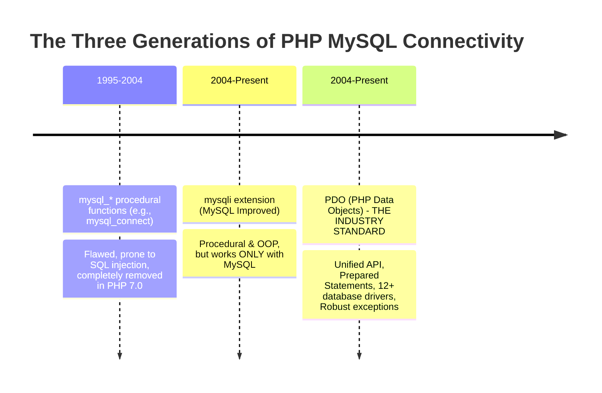
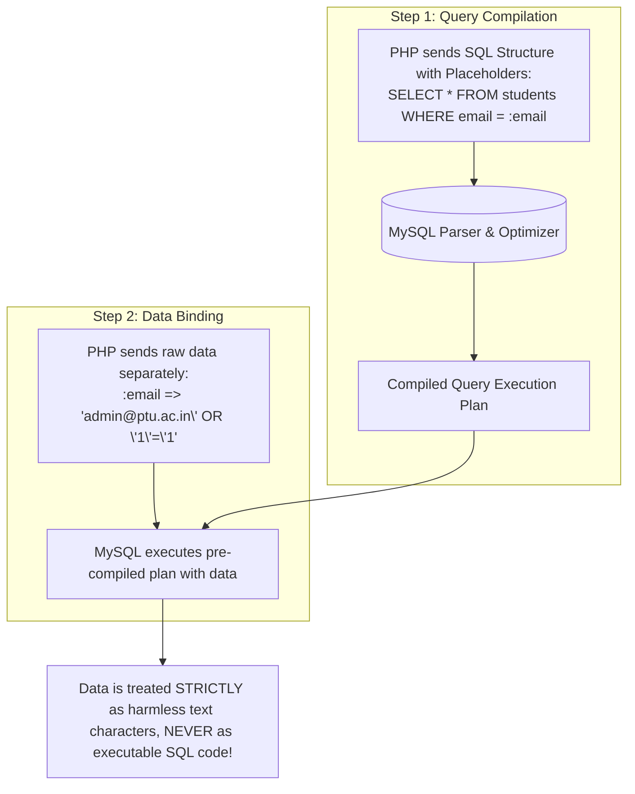
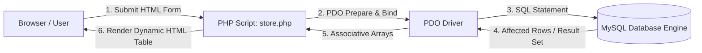

# Unit IV: Database Connectivity with MySQL & PDO
## Complete Bachelor of Computer Applications (BCA) & Computer Science Master Guide

---

### Syllabus Outline (Unit IV):
1. **Introduction to RDBMS**: Concepts of Data, Database, DBMS, RDBMS, Tables, Rows (Tuples), Columns (Attributes), Primary Keys, Foreign Keys, SQL queries.
2. **Connection with MySQL Database**: Comparison of `mysql_*` (legacy), `mysqli`, and modern `PDO`. Setting up PDO connections with error handling.
3. **Basic Database Operations / DML**:
   - `INSERT`: Adding new records
   - `SELECT`: Querying and retrieving records (with `WHERE`, `ORDER BY`, `LIMIT`)
   - `UPDATE`: Modifying existing records
   - `DELETE`: Removing records
4. **CRUD Architecture**: End-to-end integration of HTML, PHP, PDO, and MySQL.

---

## Chapter 1: Introduction to RDBMS & SQL Fundamentals

### Concept 1.1: Core Database Terminology from Absolute Zero
Many first-year BCA students confuse files with databases. Let us clarify the definitions:

- **1. Data**: Raw, unorganized facts and figures without context (e.g., `"101"`, `"Simran"`, `"95"`).
- **2. Information**: Processed, structured data that conveys clear meaning (e.g., *"Student Simran (Roll No 101) scored 95% in PHP"*).
- **3. Database**: An organized, electronic collection of structured data stored and accessed digitally on computer disks.
- **4. DBMS (Database Management System)**: A software suite that manages database files, handles data storage, and provides query interfaces (e.g., MS Access, FoxPro).
- **5. RDBMS (Relational Database Management System)**: An advanced DBMS based on the **Relational Model** introduced by E.F. Codd in 1970. In an RDBMS, data is organized into two-dimensional **Tables** (Relations) consisting of **Rows** and **Columns**, with mathematical relationships between tables.
  - *Leading Examples*: MySQL, MariaDB, PostgreSQL, Oracle, Microsoft SQL Server.

#### Key Features of an RDBMS:
1. **Relational Table Model**: Organizes data into structured grids of rows and columns.
2. **Data Integrity Constraints**: Enforces rules (`PRIMARY KEY`, `FOREIGN KEY`, `UNIQUE`, `NOT NULL`) to prevent corrupted records.
3. **Declarative Query Language (SQL)**: Expressive queries retrieve complex datasets without specifying low-level disk algorithms.
4. **ACID Transaction Support**: Guarantees that multi-step operations complete safely without partial failures.

#### Major Advantages over Plain Text / CSV Files:
- **Massive Concurrency**: Handles thousands of simultaneous read/write operations without file locking collisions.
- **Fast Indexed Searching**: B-Tree and Hash indexes locate individual records in milliseconds among millions of rows.
- **Granular Security**: Fine-grained user permissions control who can read, insert, update, or delete data.

#### Drawbacks & Trade-offs:
- Requires dedicated server memory, CPU resources, and setup overhead.
- Rigid relational schemas require explicit migration scripts when table structures evolve.

```text
Database: bca_university
|
+--- Table: courses
|    |-- id (Primary Key)
|    |-- course_name
|
+--- Table: students
     |-- id (Primary Key)
     |-- course_id (Foreign Key -> references courses.id)
     |-- name
     |-- email
```

---

### Concept 1.2: Anatomy of a Relational Table
A table in an RDBMS is structured like a spreadsheet:

```text
Table Name: students
+----+------------------+---------------------+-----------+----------+
| id | name             | email               | course    | semester |  <-- Columns / Attributes
+----+------------------+---------------------+-----------+----------+
| 1  | Amanpreet Singh  | aman@ptu.ac.in      | BCA       | 1        |  <-- Row 1 (Tuple / Record)
| 2  | Simran Kaur      | simran@ptu.ac.in    | BCA       | 1        |  <-- Row 2 (Tuple / Record)
| 3  | Rajesh Kumar     | rajesh@ptu.ac.in    | B.Tech    | 3        |  <-- Row 3 (Tuple / Record)
+----+------------------+---------------------+-----------+----------+
```

- **Table (Relation)**: The overall grid container storing a specific category of entity (e.g., `students`).
- **Column (Attribute / Field)**: A vertical vertical slice of data. Each column has a specific name and data type (e.g., `email` is `VARCHAR(100)`).
- **Row (Tuple / Record)**: A single horizontal record representing one complete individual entity (e.g., all details belonging to Amanpreet).
- **Primary Key (PK)**: A column (or group of columns) whose values **uniquely identify** every single row in the table.
  - *Rules for Primary Key*: Cannot contain `NULL` values; every row must have a unique value.
- **Foreign Key (FK)**: A column in one table that references and points to the Primary Key of another table, establishing a relationship between them.
- **Table Constraints**:
  - `PRIMARY KEY`: Enforces uniqueness and non-null values.
  - `AUTO_INCREMENT`: Automatically assigns the next sequential integer (`1, 2, 3...`) whenever a new row is added.
  - `NOT NULL`: Ensures a column cannot be left empty.
  - `UNIQUE`: Ensures no two rows can have the identical value in this column (ideal for `email` or `roll_no`).

---

### Concept 1.3: SQL Fundamentals (Structured Query Language)
SQL is divided into two primary sub-languages:
1. **DDL (Data Definition Language)**: Statements that define and alter database structure: `CREATE DATABASE`, `CREATE TABLE`, `ALTER TABLE`, `DROP TABLE`.
2. **DML (Data Manipulation Language)**: Statements that manipulate records inside tables: `INSERT`, `SELECT`, `UPDATE`, `DELETE`.

#### The Fundamental SQL Statements:
```sql
-- 1. Create a new Database
CREATE DATABASE bca_demo CHARACTER SET utf8mb4 COLLATE utf8mb4_unicode_ci;

-- 2. Use the Database
USE bca_demo;

-- 3. Create a Table with Constraints
CREATE TABLE students (
    id INT AUTO_INCREMENT PRIMARY KEY,
    name VARCHAR(100) NOT NULL,
    email VARCHAR(100) NOT NULL UNIQUE,
    course VARCHAR(50) NOT NULL,
    marks INT DEFAULT 0,
    created_at TIMESTAMP DEFAULT CURRENT_TIMESTAMP
);

-- 4. INSERT: Add a new record
INSERT INTO students (name, email, course, marks) 
VALUES ('Amanpreet Singh', 'aman@ptu.ac.in', 'BCA', 88);

-- 5. SELECT: Retrieve all records
SELECT * FROM students;

-- 6. SELECT with filtering and ordering
SELECT name, marks FROM students 
WHERE course = 'BCA' AND marks >= 50 
ORDER BY marks DESC 
LIMIT 10;

-- 7. UPDATE: Modify existing records (ALWAYS include WHERE clause!)
UPDATE students 
SET marks = 92 
WHERE id = 1;

-- 8. DELETE: Remove specific records (ALWAYS include WHERE clause!)
DELETE FROM students 
WHERE id = 1;
```

> [!WARNING]
> **Catastrophic Student Mistake in SQL**:
> Never run `UPDATE students SET marks = 90;` or `DELETE FROM students;` without a `WHERE` clause! Omitting the `WHERE` clause will overwrite or delete **EVERY SINGLE ROW** in the entire table!

---

## Chapter 2: Connecting PHP to MySQL (The Evolution from `mysql_*` to PDO)

### Concept 2.1: Evolution of PHP Database APIs



#### Why PDO is the Modern Gold Standard:
1. **Database Portability**: PDO supports 12 different database backends (MySQL, PostgreSQL, SQLite, MS SQL Server, Oracle). If your college switches from MySQL to PostgreSQL, you only change the connection string—all your query code remains identical! `mysqli` only works with MySQL.
2. **Named Parameters**: PDO supports clean, readable named parameters (`:email`, `:name`), whereas `mysqli` only supports positional question marks (`?`).
3. **Robust Object-Oriented Design**: PDO leverages PHP exceptions (`PDOException`) for error handling, preventing database credentials from leaking on the screen.

---

### Concept 2.2: Establishing a Secure PDO Connection
To connect to a database with PDO, you need a **Data Source Name (DSN)** string containing the driver, host, database name, and character set.

#### Production-Ready Database Connection (`config/database.php`):
```php
<?php
// Configuration Constants
$host = "localhost";
$db   = "bca_demo";
$user = "root";       // Default XAMPP username
$pass = "";           // Default XAMPP password is empty
$charset = "utf8mb4"; // Full Unicode support (handles emojis and international text)

// 1. Construct the DSN (Data Source Name)
$dsn = "mysql:host=$host;dbname=$db;charset=$charset";

// 2. Configure PDO Options
$options = [
    // Throw real PHP Exceptions whenever a database error occurs
    PDO::ATTR_ERRMODE            => PDO::ERRMODE_EXCEPTION,
    
    // Fetch query results as associative arrays by default: ['column' => 'value']
    PDO::ATTR_DEFAULT_FETCH_MODE => PDO::FETCH_ASSOC,
    
    // Disable emulation: Forces true server-side prepared statements
    PDO::ATTR_EMULATE_PREPARES   => false,
];

try {
    // 3. Instantiate the PDO instance
    $pdo = new PDO($dsn, $user, $pass, $options);
    // Connection successful! (In production, don't echo success to avoid breaking HTTP headers)
} catch (PDOException $e) {
    // 4. In case of failure, catch the exception securely
    // Never display raw $e->getMessage() to public users in production (it can expose passwords)
    error_log("Database Connection Error: " . $e->getMessage());
    die("Database Connection Failed! Please contact the server administrator.");
}
?>
```

---

## Chapter 3: SQL Injection & The Power of Prepared Statements

### Concept 3.1: What is SQL Injection (SQLi)?
- **Plain English Meaning**: SQL Injection is one of the most severe web vulnerabilities in existence (ranked in the OWASP Top 10 for over two decades). It occurs when untrusted user input is directly concatenated into a raw SQL query string. An attacker crafts special SQL characters (like `'` or `--`) to break out of the intended query logic and take complete control of the database.

#### The Flawed (Vulnerable) Code:
```php
// DANGEROUS CODE - DO NOT WRITE THIS!
$email = $_POST['email'];       // Attacker enters: admin@ptu.ac.in' OR '1'='1
$password = $_POST['password']; // Attacker enters: ' OR '1'='1

$sql = "SELECT * FROM users WHERE email = '$email' AND password = '$password'";
$pdo->query($sql);
```

#### What the Database Actually Sees and Executes:
```sql
SELECT * FROM users WHERE email = 'admin@ptu.ac.in' OR '1'='1' AND password = '' OR '1'='1';
```
Because `'1'='1'` is always `true`, the `WHERE` clause evaluates to true for every record in the table. The attacker logs in as the Administrator without knowing any password!

---

### Concept 3.2: How Prepared Statements Eliminate SQL Injection



With **Prepared Statements**, the SQL query structure and the user-supplied data are sent to the database in **two completely separate network transmissions**:
1. First, the database compiles and locks in the query blueprint (`SELECT * FROM users WHERE email = :email`).
2. Then, the user input is bound to the placeholder. Even if the user types `DROP TABLE students;`, the database treats that entire string merely as literal text within quotes. **SQL Injection is mathematically impossible!**

---

## Chapter 4: Basic Database Operations / DML with PDO Prepared Statements

### 1. `INSERT`: Adding a New Student Record
```php
<?php
require_once "config/database.php";

$name = "Harpreet Kaur";
$email = "harpreet@ptu.ac.in";
$course = "BCA";
$marks = 85;

// Step 1: Prepare the SQL statement with named placeholders (:name, :email, etc.)
$sql = "INSERT INTO students (name, email, course, marks) VALUES (:name, :email, :course, :marks)";
$stmt = $pdo->prepare($sql);

// Step 2: Execute by passing an associative array of parameters
$success = $stmt->execute([
    ':name'   => $name,
    ':email'  => $email,
    ':course' => $course,
    ':marks'  => $marks
]);

if ($success) {
    // Get the auto-increment ID generated by MySQL
    $newId = $pdo->lastInsertId();
    echo "Student record created successfully with ID: " . $newId . "<br>";
}
?>
```

---

### 2. `SELECT`: Querying Records (`fetch` vs `fetchAll`)
- **`fetch()`**: Retrieves a **single row** from the result set. Perfect when querying by Primary Key (e.g., `WHERE id = :id`).
- **`fetchAll()`**: Retrieves **all matching rows** into an array of associative arrays. Perfect for displaying a table list of students.

#### Reading a Single Record:
```php
<?php
require_once "config/database.php";

$studentId = 1;

$stmt = $pdo->prepare("SELECT * FROM students WHERE id = :id");
$stmt->execute([':id' => $studentId]);

$student = $stmt->fetch(); // Returns single associative array or false if not found

if ($student) {
    echo "Student Name: " . htmlspecialchars($student['name']) . "<br>";
    echo "Student Email: " . htmlspecialchars($student['email']) . "<br>";
} else {
    echo "Student not found!<br>";
}
?>
```

#### Reading All Records with Loop:
```php
<?php
require_once "config/database.php";

$stmt = $pdo->prepare("SELECT * FROM students ORDER BY name ASC");
$stmt->execute();
$allStudents = $stmt->fetchAll();

echo "<h4>Total Enrolled Students: " . count($allStudents) . "</h4>";
echo "<table border='1' cellpadding='8'>";
echo "<tr><th>ID</th><th>Name</th><th>Email</th><th>Course</th><th>Marks</th></tr>";

foreach ($allStudents as $row) {
    echo "<tr>";
    echo "<td>" . $row['id'] . "</td>";
    echo "<td>" . htmlspecialchars($row['name']) . "</td>";
    echo "<td>" . htmlspecialchars($row['email']) . "</td>";
    echo "<td>" . htmlspecialchars($row['course']) . "</td>";
    echo "<td>" . $row['marks'] . "</td>";
    echo "</tr>";
}
echo "</table>";
?>
```

---

### 3. `UPDATE`: Modifying Existing Records
```php
<?php
require_once "config/database.php";

$studentId = 1;
$newMarks = 95;

$sql = "UPDATE students SET marks = :marks WHERE id = :id";
$stmt = $pdo->prepare($sql);

$stmt->execute([
    ':marks' => $newMarks,
    ':id'    => $studentId
]);

// rowCount() returns the number of rows affected by the query
echo "Records updated: " . $stmt->rowCount() . "<br>";
?>
```

---

### 4. `DELETE`: Removing a Record Safely
```php
<?php
require_once "config/database.php";

$studentId = 5;

$sql = "DELETE FROM students WHERE id = :id";
$stmt = $pdo->prepare($sql);
$stmt->execute([':id' => $studentId]);

if ($stmt->rowCount() > 0) {
    echo "Student deleted successfully.<br>";
} else {
    echo "No student found with ID: " . $studentId . "<br>";
}
?>
```

---

## Chapter 5: The Complete CRUD Architectural Cycle

**CRUD** stands for the four foundational operations of persistent software:
- **C** = **Create** (`INSERT INTO`)
- **R** = **Read** (`SELECT`)
- **U** = **Update** (`UPDATE ... SET`)
- **D** = **Delete** (`DELETE FROM`)



---

## Unit IV: Exam Blueprint, Viva Questions & Practice

### High-Probability University Exam Questions:
1. **(10 Marks)**: *What is an RDBMS? Explain Primary Keys, Foreign Keys, and Table Constraints with an example schema.*
2. **(10 Marks)**: *What is SQL Injection? Explain how attackers exploit dynamic queries and how PDO Prepared Statements neutralize this threat completely.*
3. **(5 Marks)**: *Compare `mysql_*`, `mysqli`, and `PDO` extensions in PHP. Why is PDO preferred?*
4. **(5 Marks)**: *Write a complete PHP script to connect to a MySQL database using PDO with proper exception handling.*
5. **(5 Marks)**: *Differentiate between `fetch()` and `fetchAll()` in PDO with code examples.*
6. **(2 Marks)**: *What is the role of `lastInsertId()` in PDO?*
7. **(2 Marks)**: *What is the purpose of `rowCount()` after executing an UPDATE or DELETE statement?*

### Viva Voce Quick-Fire Prep:
- **Q: Why was the original `mysql_connect()` removed from PHP 7.0?**
  - **A**: It lacked prepared statements, was severely vulnerable to SQL injection, did not support modern object-oriented paradigms, and had performance bottlenecks.
- **Q: What is a DSN in PDO?**
  - **A**: DSN stands for Data Source Name. It is a connection string specifying the database driver (e.g., `mysql:`), host, port, database name, and character set.
- **Q: Can SQL Injection occur if you use prepared statements with placeholders?**
  - **A**: No, sir. Because the database engine compiles the SQL command structure first before binding the user parameters, the input is strictly treated as passive literal data, never as executable SQL.
- **Q: What does `PDO::ATTR_ERRMODE => PDO::ERRMODE_EXCEPTION` do?**
  - **A**: It configures PDO to throw exceptions whenever a SQL or connection error occurs, allowing errors to be trapped inside a `try...catch` block.

### Student Practice Exercises:
1. Write a script `register_student.php` that receives a student's name, email, and course via POST, validates that the email is not already taken in the database, and inserts the record using PDO.
2. Write a search script that takes a student name query via GET and displays all matching students using `WHERE name LIKE :query`.
3. Create a table `books` (id, title, author, price). Write a PHP script that increases the price of all books by 10% using an `UPDATE` query.
