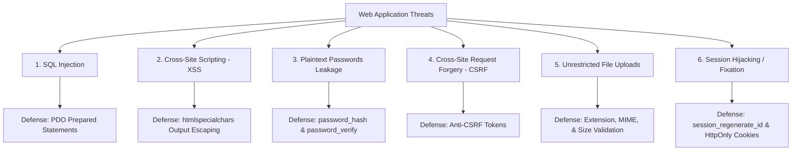

# Unit V: Web Security Fundamentals & Bootstrap 5
## BCA 1st Year Master Guide — I.K. Gujral Punjab Technical University (IKGPTU)

---

### Syllabus & Practical Project Integration:
To build the final university capstone project (**BCA Student Management System**), a 1st-year student must understand two critical real-world domains:
1. **Web Application Security**: How to defend applications against hackers, data theft, and unauthorized access.
2. **Bootstrap 5 UI Framework**: How to build modern, responsive, mobile-friendly interfaces without writing thousands of lines of custom CSS.

---

## Chapter 1: Web Application Security for Beginners

Security is not an afterthought; it must be designed into every line of code you write.



---

### Concept 1.1: Password Security: Hashing vs Plaintext
> [!CAUTION]
> **NEVER STORE PASSWORDS AS PLAIN TEXT OR USING MD5/SHA1!**
> If your database is ever compromised, plain text passwords expose all user accounts immediately. MD5 and SHA1 can be cracked in seconds using precomputed rainbow tables.

#### The Modern Solution: Bcrypt with `password_hash()` and `password_verify()`
PHP provides state-of-the-art, cryptographic one-way hashing built directly into the core:
- **`password_hash($password, PASSWORD_BCRYPT)`**: Creates a slow, irreversible 60-character cryptographic hash with an automatically generated cryptographic salt.
- **`password_verify($password, $hash)`**: Checks if a user-entered password matches the stored hash.

```php
<?php
// 1. REGISTRATION: Creating a secure password hash
$userPassword = "MySecretPassword123";
$hashedPassword = password_hash($userPassword, PASSWORD_BCRYPT);

echo "Original Plaintext: " . $userPassword . "<br>";
echo "Stored Hash (60 chars): " . $hashedPassword . "<br><br>";
// Example Hash: $2y$10$e8T7QpZ/hR9KqXgWjYnUee0Yw...

// 2. LOGIN ATTEMPT: Verifying user credentials
$loginInput = "MySecretPassword123";

if (password_verify($loginInput, $hashedPassword)) {
    echo "Login Status: PASSWORD MATCHES! Authentication granted.<br>";
} else {
    echo "Login Status: INVALID PASSWORD! Authentication denied.<br>";
}
?>
```

---

### Concept 1.2: Cross-Site Scripting (XSS) & Output Escaping
- **What is XSS?**: An attack where a malicious user enters JavaScript code into an input field (like a student name or profile bio). When another user or admin views that student's profile, the malicious script executes in their browser, potentially stealing their login session cookie.
- **The Defense**: Always pass dynamic data through `htmlspecialchars()` before printing it into HTML:
```php
<?php
// User typed this into the name field:
$maliciousInput = "<script>alert('Your account is hacked!');</script>";

// UNSAFE: Renders the script tag directly, popping up an alert!
// echo $maliciousInput;

// SECURE: Escapes < and > into &lt; and &gt;
echo htmlspecialchars($maliciousInput, ENT_QUOTES, 'UTF-8');
?>
```

---

### Concept 1.3: Cross-Site Request Forgery (CSRF)
- **What is CSRF?**: An attack that tricks an authenticated victim into submitting a malicious request to a web application without their knowledge (e.g., clicking a link in an email that triggers `delete_student.php?id=5`).
- **Defense Strategies**:
  1. **Never use GET requests for state-changing actions!** Deleting, inserting, or updating records must **always** use `POST`.
  2. **Anti-CSRF Tokens**: Generate a random secret token stored in `$_SESSION['csrf_token']` and embed it in every form as a hidden field. When the form is submitted, verify that the submitted token matches the session token.

```php
<?php
// 1. Generate CSRF Token if not already set
if (empty($_SESSION['csrf_token'])) {
    $_SESSION['csrf_token'] = bin2hex(random_bytes(32));
}

// 2. Verification on POST submission
if ($_SERVER['REQUEST_METHOD'] === 'POST') {
    $submittedToken = $_POST['csrf_token'] ?? '';
    if (!hash_equals($_SESSION['csrf_token'], $submittedToken)) {
        die("Security Alert: CSRF token validation failed! Request aborted.");
    }
}
?>

<!-- Embedded in HTML Form -->
<input type="hidden" name="csrf_token" value="<?php echo $_SESSION['csrf_token']; ?>">
```

---

### Concept 1.4: Session Management & Session Fixation Defense
- **`session_start()`**: Must be called at the very beginning of every script that uses sessions.
- **Session Fixation**: An attack where a malicious user forces a known Session ID on a victim.
- **The Defense**: Always call `session_regenerate_id(true)` immediately upon a successful user login! This invalidates the old session ID and issues a brand-new cryptographic session ID.
- **Safe Logout**:
```php
<?php
session_start();
// Unset all session variables
$_SESSION = [];
// Delete session cookie from browser
if (ini_get("session.use_cookies")) {
    $params = session_get_cookie_params();
    setcookie(session_name(), '', time() - 42000,
        $params["path"], $params["domain"],
        $params["secure"], $params["httponly"]
    );
}
// Destroy the session on the server
session_destroy();
header("Location: login.php");
exit();
?>
```

---

## Chapter 2: Bootstrap 5 Fundamentals for PHP Developers

### Concept 2.1: What is Bootstrap?
- **Plain English Meaning**: Bootstrap is the world's most popular, free, open-source front-end CSS framework. It provides pre-styled HTML components (buttons, navbars, cards, tables, forms, modals) and a flexible 12-column responsive layout grid system.
- **Why It Matters**: Instead of spending 50 hours writing custom CSS rules for media queries and margins, you simply add descriptive class names like `class="btn btn-primary"` or `class="table table-striped"`.

```html
<!-- Include Bootstrap 5 via CDN in your <head> -->
<link href="https://cdn.jsdelivr.net/npm/bootstrap@5.3.3/dist/css/bootstrap.min.css" rel="stylesheet">
<!-- Include Bootstrap 5 JavaScript Bundle at the end of <body> -->
<script src="https://cdn.jsdelivr.net/npm/bootstrap@5.3.3/dist/js/bootstrap.bundle.min.js"></script>
```

---

### Concept 2.2: The Bootstrap 12-Column Responsive Grid System
The core layout structure in Bootstrap consists of three levels:
1. **Container** (`.container` or `.container-fluid`): Wraps the layout and provides horizontal padding.
2. **Row** (`.row`): A horizontal flexbox container that groups columns.
3. **Columns** (`.col-*`): The 12-column subdivision system.
   - `col-md-6`: Takes 6 columns (half width) on medium screens (laptops) and 12 columns (full width) on mobile phones.
   - `col-md-4`: Takes 4 columns (one-third width).
   - `col-md-12`: Takes full width.

```text
+-------------------------------------------------------------------------+
| .container                                                              |
|  +-------------------------------------------------------------------+  |
|  | .row                                                              |  |
|  |  +-----------------------+ +-----------------------+              |  |
|  |  | .col-md-6 (50% Width) | | .col-md-6 (50% Width) |              |  |
|  |  +-----------------------+ +-----------------------+              |  |
|  +-------------------------------------------------------------------+  |
+-------------------------------------------------------------------------+
```

---

### Concept 2.3: Essential Bootstrap Components Reference Table

| Component | Essential Bootstrap 5 Classes | Purpose & Visual Result |
| :--- | :--- | :--- |
| **Navbar** | `navbar navbar-expand-lg navbar-dark bg-primary` | Responsive navigation bar with collapsing mobile menu. |
| **Card** | `card shadow-sm`, `card-header`, `card-body` | Beautiful white container box with rounded corners and subtle shadow. |
| **Table** | `table table-bordered table-hover table-striped` | Zebra-striped, bordered table with smooth hover highlights. |
| **Buttons** | `btn btn-primary`, `btn-success`, `btn-danger` | Pre-styled interactive buttons with hover transitions and focus rings. |
| **Form Inputs** | `form-label`, `form-control`, `form-select` | Modern input fields with subtle borders and blue focus glow. |
| **Alerts** | `alert alert-success alert-dismissible fade show` | Colored banner notification boxes for flash success/error messages. |
| **Badges** | `badge bg-info text-dark`, `badge bg-success` | Small pill labels (e.g., showing Course name or Semester count). |
| **Pagination**| `pagination`, `page-item`, `page-link` | Clean numbered page-navigation buttons (`<< 1 2 3 >>`). |

---

### Concept 2.4: Sample Bootstrap Form Snippet for BCA Portal
```html
<div class="card shadow-sm mb-4">
    <div class="card-header bg-primary text-white">
        <h5 class="mb-0"><i class="bi bi-person-plus"></i> Add New Student</h5>
    </div>
    <div class="card-body">
        <form method="POST" action="store.php" enctype="multipart/form-data">
            <div class="row">
                <div class="col-md-6 mb-3">
                    <label class="form-label">Full Name</label>
                    <input type="text" name="name" class="form-control" placeholder="e.g. Amanpreet Singh" required>
                </div>
                <div class="col-md-6 mb-3">
                    <label class="form-label">College Email</label>
                    <input type="email" name="email" class="form-control" placeholder="e.g. aman@ptu.ac.in" required>
                </div>
            </div>
            <div class="mb-3">
                <label class="form-label">Upload Profile Photo</label>
                <input type="file" name="photo" class="form-control" accept="image/*">
            </div>
            <button type="submit" class="btn btn-success">Save Student Record</button>
            <a href="index.php" class="btn btn-secondary">Cancel</a>
        </form>
    </div>
</div>
```
