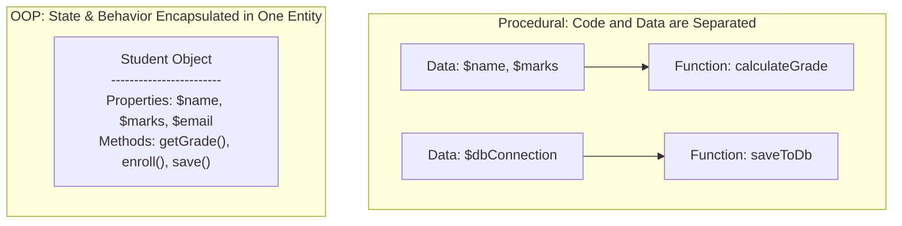
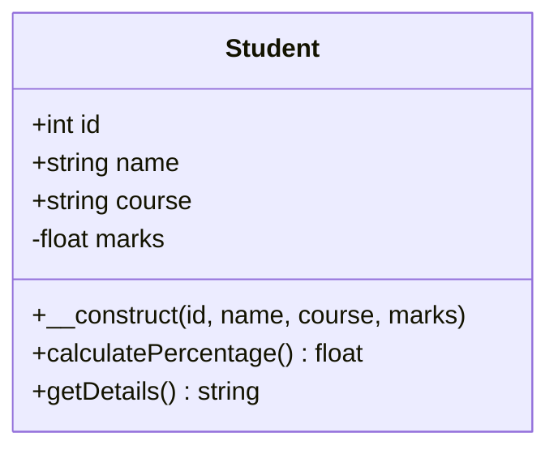
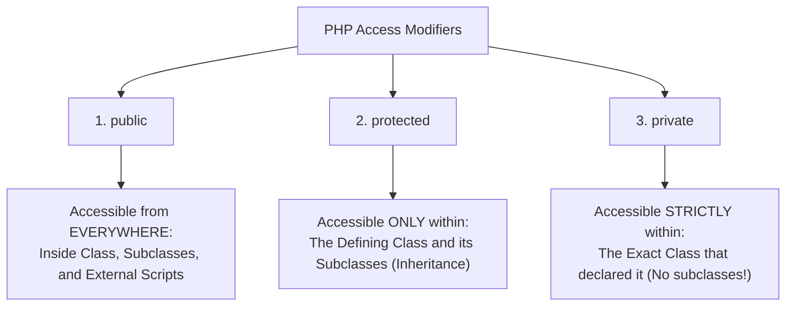
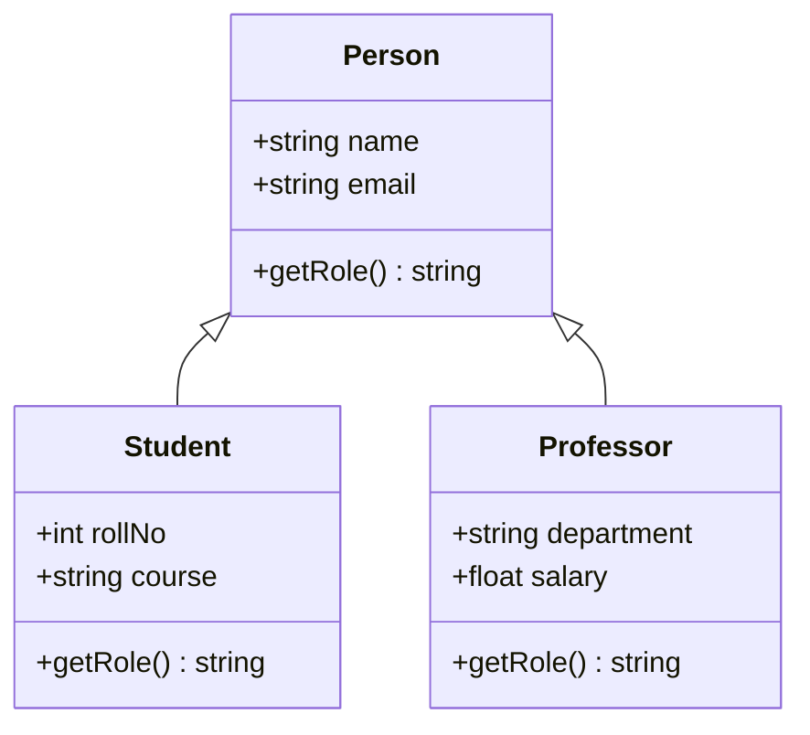
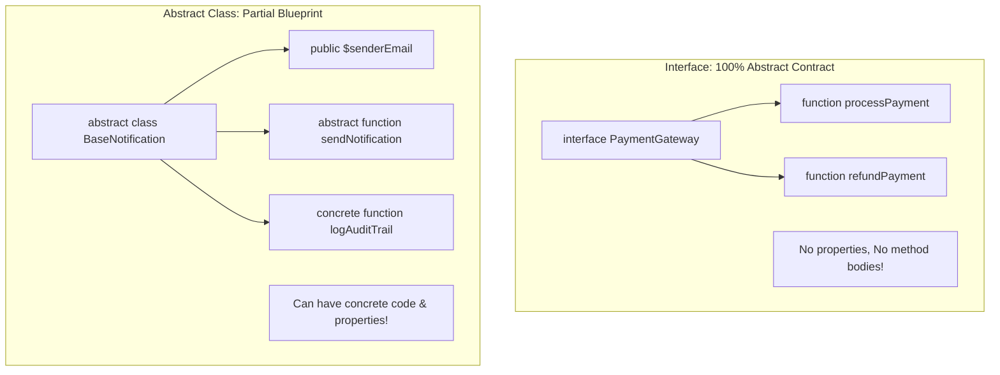
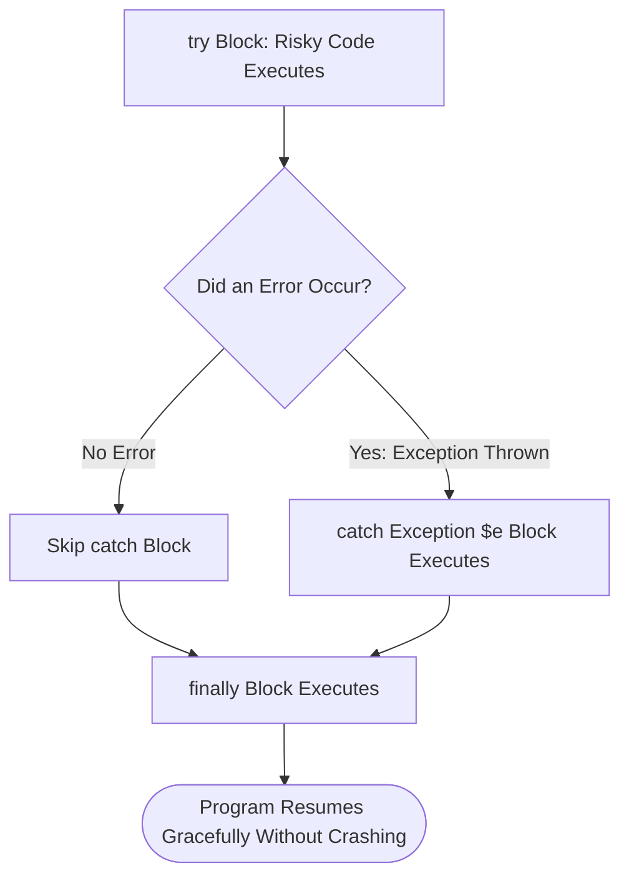
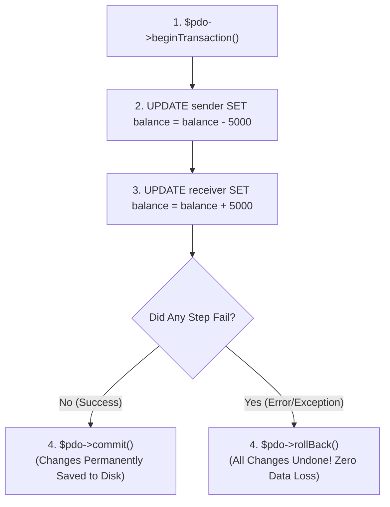

# Unit VI: Object-Oriented PHP, Error Handling, JSON REST APIs & Transactions
## The Definitive Advanced Reference Manual for University Computer Science Students

---

### Introduction: Why This Master Extension Exists
In contemporary software engineering and university degree examinations, knowing basic procedural PHP is only the first step. Modern enterprise frameworks (like Laravel and Symfony), industry web applications, and senior university syllabi demand complete mastery over:
1. **Object-Oriented Programming (OOP)** in PHP (Classes, Objects, Inheritance, Encapsulation, Polymorphism, Interfaces, Traits).
2. **Robust Error & Exception Handling** (`try`, `catch`, `finally`, Custom Exceptions).
3. **Deep Architectural Comparison: Sessions vs Cookies** (Stateless HTTP, Storage, Security Flags).
4. **JSON Processing & RESTful API Construction** (`json_encode`, `json_decode`, API Endpoints).
5. **Database Transactions & ACID Properties in PDO** (`beginTransaction`, `commit`, `rollBack`).
6. **Modern PHP 8+ Innovations** (`match`, Nullsafe Operator `?->`, Constructor Promotion, Named Arguments).

This textbook-grade module delivers **Features**, **Advantages**, **Drawbacks / Limitations**, **ASCII & Mermaid Diagrams**, **Minimal Examples**, **Line-by-Line Explanations**, and **Viva Questions** for every topic so that you **never need to open another textbook**.

---

## Chapter 1: Object-Oriented Programming (OOP) in PHP

### Concept 1.1: Procedural Programming vs Object-Oriented Programming
- **Procedural Programming**: Code is structured as a series of linear functions and procedures acting on raw, detached data structures. Common in early PHP scripts.
- **Object-Oriented Programming (OOP)**: Code is structured around **Objects**—self-contained computational entities that bundle together both **State** (Properties/Variables) and **Behavior** (Methods/Functions).



#### Detailed Comparison Table: Procedural vs Object-Oriented

| Comparison Parameter | Procedural Programming | Object-Oriented Programming (OOP) |
| :--- | :--- | :--- |
| **Primary Unit** | Functions and linear procedures. | Classes and Objects. |
| **Data Security** | Data is exposed globally or passed across functions; vulnerable to accidental corruption. | Data is protected and hidden inside classes via Access Modifiers (`private`, `protected`). |
| **Code Reusability** | Limited; requires copy-pasting functions or complex procedural file includes. | High; achieved through Inheritance (`extends`) and Traits. |
| **Maintenance** | Difficult to maintain as projects grow beyond 5,000 lines of code. | Modular, clean, testable, and ideal for large enterprise web systems. |
| **Real-World Modeling** | Focuses on step-by-step logic algorithms. | Accurately models real-world business entities (Students, Bank Accounts, Orders). |

---

### Concept 1.2: Classes, Objects, and the `$this` Pseudo-Variable

#### 1. What is a Class?
A **Class** is an abstract blueprint, prototype, or architectural template from which individual concrete objects are instantiated.
- *Real-World Analogy*: The blueprinted architectural drawing of a 3-bedroom house. You cannot sleep inside an architectural drawing; it is merely an instruction set.

#### 2. What is an Object?
An **Object** is a concrete, physical instance of a class living in computer memory (RAM).
- *Real-World Analogy*: The actual physical house constructed with concrete, bricks, and paint based on that blueprint. You can build 50 identical houses from one blueprint.

#### 3. What is `$this`?
`$this` is a special built-in pseudo-variable in PHP that refers to the **current, calling object instance** from within a class method.



#### Code Example:
```php
<?php
// 1. Class Blueprint Definition
class Student {
    // Properties (Member Variables)
    public int $id;
    public string $name;
    public string $course;
    private float $marks;

    // Constructor: Automatically executed upon object instantiation
    public function __construct(int $id, string $name, string $course, float $marks) {
        $this->id = $id;
        $this->name = $name;
        $this->course = $course;
        $this->marks = $marks;
    }

    // Method (Member Function)
    public function calculatePercentage(float $totalMarks = 500.0): float {
        return ($this->marks / $totalMarks) * 100;
    }

    public function getDetails(): string {
        return "Student #{$this->id}: {$this->name} | Program: {$this->course}";
    }
}

// 2. Object Instantiation (Creating concrete objects in RAM)
$student1 = new Student(101, "Amanpreet Singh", "Computer Science", 435.0);
$student2 = new Student(102, "Simran Kaur", "Information Technology", 460.0);

echo $student1->getDetails() . "<br>";
echo "Percentage: " . $student1->calculatePercentage() . "%<br><br>";

echo $student2->getDetails() . "<br>";
echo "Percentage: " . $student2->calculatePercentage() . "%<br>";
?>
```

#### Line-by-Line Breakdown:
1. `class Student`: Declares the template name.
2. `public int $id;`: Declares a strongly typed public property `$id`.
3. `private float $marks;`: The `private` modifier locks `$marks` so outside code cannot directly tamper with it.
4. `public function __construct(...)`: The magical constructor function that initializes property values when `new Student(...)` is invoked.
5. `$this->id = $id;`: Sets the current object's `$id` property using the passed argument.
6. `$student1 = new Student(...)`: Allocates memory and creates the first concrete object instance.

---

### Concept 1.3: Access Modifiers (Encapsulation)

Encapsulation is the OOP principle of bundling data and methods inside a single unit while restricting direct external access to prevent unintended tampering.



#### Access Modifiers Visibility Matrix:

| Access Modifier | Inside Defining Class | Inside Child Subclasses (`extends`) | From Outside Object Instance (`$obj->prop`) |
| :--- | :---: | :---: | :---: |
| **`public`** | ✅ Yes | ✅ Yes | ✅ Yes |
| **`protected`** | ✅ Yes | ✅ Yes | ❌ No (Fatal Error) |
| **`private`** | ✅ Yes | ❌ No (Fatal Error) | ❌ No (Fatal Error) |

#### Features of Encapsulation:
- Restricts direct read/write manipulation of internal object state.
- Exposes clean **Getters** and **Setters** that validate input before saving.

#### Advantages:
- Prevents invalid or corrupted data (e.g., setting `$age = -15` or `$marks = 5000`).
- Allows class maintainers to modify internal logic without breaking external code.

#### Drawbacks:
- Requires writing boilerplate getter and setter methods.
- Slight performance overhead compared to direct public property access.

#### Practical Getter/Setter Example:
```php
<?php
class BankAccount {
    private string $accountNumber;
    private float $balance;

    public function __construct(string $accNo, float $initialBalance) {
        $this->accountNumber = $accNo;
        $this->balance = max(0.0, $initialBalance);
    }

    // Getter for Balance (Read-only access)
    public function getBalance(): float {
        return $this->balance;
    }

    // Setter with Validation
    public function deposit(float $amount): void {
        if ($amount <= 0) {
            throw new InvalidArgumentException("Deposit amount must be positive!");
        }
        $this->balance += $amount;
    }
}

$acc = new BankAccount("AC-CS-9876", 5000.0);
$acc->deposit(1500.0);
echo "Current Balance: ₹" . $acc->getBalance(); // ₹6500
?>
```

---

### Concept 1.4: Inheritance (`extends`) and Method Overriding

- **What is Inheritance?**: The mechanism where a child subclass inherits all public and protected properties and methods from a parent superclass.
- **Why It Exists**: Eliminates duplicate code by centralizing shared functionality in a base class.



#### Code Example:
```php
<?php
// Parent Class (Base Class)
class Person {
    public string $name;
    public string $email;

    public function __construct(string $name, string $email) {
        $this->name = $name;
        $this->email = $email;
    }

    public function getProfile(): string {
        return "Name: {$this->name} | Email: {$this->email}";
    }

    public function getRole(): string {
        return "General University Member";
    }
}

// Child Class (Derived Subclass) inheriting Person
class CollegeStudent extends Person {
    public int $rollNo;
    public string $course;

    public function __construct(string $name, string $email, int $rollNo, string $course) {
        // Call Parent Constructor
        parent::__construct($name, $email);
        $this->rollNo = $rollNo;
        $this->course = $course;
    }

    // Method Overriding (Polymorphism): Changing parent behavior
    public function getRole(): string {
        return "Undergraduate Student (Roll No: {$this->rollNo}, Course: {$this->course})";
    }
}

$student = new CollegeStudent("Aman", "aman@univ.edu", 101, "Computer Science");
echo $student->getProfile() . "<br>"; // Inherited from Person
echo "Role: " . $student->getRole();    // Overridden in CollegeStudent
?>
```

---

### Concept 1.5: Abstract Classes vs Interfaces

University degree examinations frequently test the differences between Abstract Classes and Interfaces:



#### Comprehensive Comparison Table:

| Feature | Interface (`interface` / `implements`) | Abstract Class (`abstract class` / `extends`) |
| :--- | :--- | :--- |
| **Method Implementation**| **Zero concrete methods.** Methods must only declare signatures, no bodies `{}`. (PHP 8 does not allow concrete code). | Can contain **both** abstract methods (without bodies) AND fully implemented concrete methods. |
| **Properties** | Cannot declare instance variables/properties (can only declare constants `const`). | Can declare instance properties with all access modifiers (`public`, `protected`, `private`). |
| **Multiple Inheritance** | **A class can implement multiple interfaces** (`implements A, B, C`). | **A class can extend only ONE abstract class** (Single inheritance). |
| **Usage Intent** | Defines a strict capability contract (*"What an object can do"*). | Defines a foundational identity hierarchy (*"What an object is"*). |

#### Interface Code Example:
```php
<?php
// Interface Contract
interface Authenticatable {
    public function login(string $username, string $password): bool;
    public function logout(): void;
}

// Concrete Implementation
class StudentUser implements Authenticatable {
    public function login(string $username, string $password): bool {
        // Concrete verification logic
        return ($username === "student" && $password === "secret123");
    }

    public function logout(): void {
        echo "Student session terminated successfully.<br>";
    }
}

$user = new StudentUser();
if ($user->login("student", "secret123")) {
    echo "Login authorized!<br>";
    $user->logout();
}
?>
```

---

## Chapter 2: Modern Error & Exception Handling in PHP

### Concept 2.1: Errors vs Exceptions
- **Traditional PHP Errors**: Generated by the internal PHP engine (e.g., Notice: Undefined variable; Warning: Division by zero; Fatal error: Call to undefined function). In early PHP, errors were difficult to trap and frequently crashed scripts.
- **Exceptions (Modern Standard)**: Object-oriented error representations. An exception is an object of class `Exception` (or a subclass) that is **thrown** when an exceptional failure occurs, and can be **caught** and gracefully resolved by enclosing code.



---

### Concept 2.2: The `try - catch - finally` Statement

#### Features:
- Isolates potentially dangerous code (database connections, file reading, remote API calls).
- The `finally` block **always executes**, regardless of whether an exception was thrown or caught. Perfect for closing database connections and file handles!

#### Code Example:
```php
<?php
function divideMarks(float $obtained, float $max): float {
    if ($max <= 0) {
        // Throw an explicit runtime exception
        throw new InvalidArgumentException("Maximum total marks must be strictly greater than zero!");
    }
    return ($obtained / $max) * 100;
}

try {
    echo "Calculating result...<br>";
    $percentage = divideMarks(85, 0); // Triggers exception!
    echo "Percentage: " . $percentage . "%<br>"; // Skipped!
} catch (InvalidArgumentException $e) {
    // Graceful error recovery
    echo "<strong>Error Caught:</strong> " . htmlspecialchars($e->getMessage()) . "<br>";
    echo "<strong>Error on Line:</strong> " . $e->getLine() . "<br>";
} finally {
    // Guaranteed to execute
    echo "<em>Clean-up completed. Execution finished safely.</em><br>";
}
?>
```

#### Output:
```text
Calculating result...
Error Caught: Maximum total marks must be strictly greater than zero!
Error on Line: 5
Clean-up completed. Execution finished safely.
```

---

### Concept 2.3: Production vs Development Error Configuration
In university exams, examiners often ask how to configure PHP for Development vs Production:

| Setting in `php.ini` or Script | Development Environment | Production Live Server |
| :--- | :--- | :--- |
| `error_reporting(...)` | `E_ALL` (Reports every warning, notice, and error). | `E_ALL & ~E_DEPRECATED & ~E_STRICT` |
| `ini_set('display_errors', ...)` | `1` (Display errors on screen for debugging). | **`0` (CRITICAL: Never show errors to public visitors!).** |
| `ini_set('log_errors', ...)` | `1` (Log errors to file). | `1` (Log all errors securely to server disk logs). |

---

## Chapter 3: Architectural Deep Dive: Cookies vs Sessions

### Concept 3.1: Why Do We Need State Management?
The HTTP protocol is fundamentally **Stateless**. When you visit `page1.php`, download it, and then click a link to `page2.php`, the web server has complete amnesia—it does not remember who you are, whether you logged in, or what products were in your shopping cart. 

To bridge this gap, web architectures rely on **Cookies** and **Sessions**.

```mermaid
sequenceDiagram
    autonumber
    actor User as Student
    participant Browser as Browser (Client)
    participant Server as PHP Engine (Server)

    Note over Browser,Server: Step 1: Login Request
    User->>Browser: Submits Email & Password
    Browser->>Server: POST /login.php
    Server->>Server: Verifies Password & calls session_start()
    Server->>Server: Creates session file on disk (/tmp/sess_abc123)
    Server-->>Browser: HTTP 200 OK + Set-Cookie: PHPSESSID=abc123; HttpOnly; SameSite=Lax

    Note over Browser,Server: Step 2: Subsequent Page Request
    User->>Browser: Clicks "My Grades" (dashboard.php)
    Browser->>Server: GET /dashboard.php (Cookie Header: PHPSESSID=abc123)
    Server->>Server: Reads sess_abc123 from disk & knows User is Authenticated!
    Server-->>Browser: Returns Protected Grades Page
```

---

### Concept 3.2: Comprehensive Comparison: Cookies vs Sessions

| Comparison Feature | Cookie | Session |
| :--- | :--- | :--- |
| **Storage Location** | Stored on the **Client's physical computer/browser** in text files. | Stored on the **Server's hard drive or RAM** (e.g., `/tmp/sess_*`). |
| **Data Capacity** | Maximum **4 Kilobytes (4,096 bytes)** per cookie. | Virtually **unlimited** (limited only by server disk/memory capacity). |
| **Security** | **Low.** Users can view, edit, modify, or forge cookie values via browser dev tools. | **High.** Raw session data never leaves the server; client only holds an opaque Session ID. |
| **Lifespan** | Can persist for years if an explicit expiry timestamp is set (`time() + 86400 * 30`). | Typically expires when browser is closed or after 24 minutes of inactivity. |
| **Data Types** | Can store **only plain text strings**. | Can store **any complex PHP data type** (Arrays, Objects, Integers). |
| **Bandwidth Impact** | Sent with **every single HTTP request** in request headers. | Only transmits the small 26-32 character Session ID string over headers. |

#### Setting Cookies Safely in PHP:
```php
<?php
// Modern secure cookie setting (PHP 7.3+)
$cookieName = "user_theme";
$cookieValue = "dark_mode";

$cookieOptions = [
    'expires'  => time() + (86400 * 30), // Valid for 30 days
    'path'     => '/',                   // Accessible across entire domain
    'domain'   => '',                    // Default host
    'secure'   => false,                 // Set true for HTTPS only
    'httponly' => true,                  // INACCESSIBLE TO JAVASCRIPT (Defeats XSS cookie theft)
    'samesite' => 'Lax'                  // Protects against CSRF
];

setcookie($cookieName, $cookieValue, $cookieOptions);
?>
```

---

## Chapter 4: Working with JSON & Building REST APIs in PHP

### Concept 4.1: What is JSON?
- **Full Form**: **J**ava**S**cript **O**bject **N**otation.
- **What is it?**: A lightweight, human-readable, language-independent text format used to serialize and transmit data objects between servers and web/mobile applications.
- **Why It Matters**: Today's websites communicate with mobile apps (Android/iOS) and frontend frameworks (React, Vue, Angular) via JSON over REST APIs.

---

### Concept 4.2: Encoding and Decoding JSON in PHP

#### 1. `json_encode($data, $flags)`: PHP Array/Object $\rightarrow$ JSON String
Converts PHP data into a standardized JSON string.

#### 2. `json_decode($jsonString, $assoc)`: JSON String $\rightarrow$ PHP Array/Object
Parses a JSON string. **Crucial Parameter**: If `$assoc = true`, it returns an **Associative Array**; if `false` or omitted, it returns a PHP generic `stdClass` Object!

```php
<?php
// 1. PHP Array to JSON string
$studentData = [
    "roll_no"  => 101,
    "name"     => "Amanpreet Singh",
    "course"   => "Computer Science",
    "subjects" => ["PHP", "MySQL", "Computer Networks"],
    "is_enrolled" => true
];

// JSON_PRETTY_PRINT formats with indentation
$jsonString = json_encode($studentData, JSON_PRETTY_PRINT);
echo "<h4>Encoded JSON Output:</h4>";
echo "<pre>" . htmlspecialchars($jsonString) . "</pre>";

// 2. JSON string back to PHP Associative Array
$parsedArray = json_decode($jsonString, true);
echo "Decoded Student Name: " . $parsedArray["name"] . "<br>";
echo "First Subject: " . $parsedArray["subjects"][0] . "<br>";
?>
```

---

### Concept 4.3: Building a Simple JSON REST API Endpoint in PHP
Below is a complete, standalone, production-ready REST API endpoint (`api/students.php`) returning JSON data to mobile apps:

```php
<?php
// File: api/students.php
// 1. Set Response Header to application/json
header("Content-Type: application/json; charset=UTF-8");
header("Access-Control-Allow-Origin: *"); // Allows cross-origin API calls

// 2. Mock Database Data
$students = [
    ["id" => 1, "name" => "Amanpreet Singh", "course" => "Computer Science", "marks" => 88],
    ["id" => 2, "name" => "Simran Kaur", "course" => "Computer Science", "marks" => 94],
    ["id" => 3, "name" => "Rajesh Kumar", "course" => "Information Technology", "marks" => 76]
];

// 3. Inspect HTTP Request Method
$requestMethod = $_SERVER["REQUEST_METHOD"];

if ($requestMethod === "GET") {
    // Return all students in standard API response format
    http_response_code(200); // 200 OK
    echo json_encode([
        "status"  => "success",
        "count"   => count($students),
        "data"    => $students
    ]);
    exit();
} else {
    // Method Not Allowed
    http_response_code(405);
    echo json_encode([
        "status"  => "error",
        "message" => "HTTP Method Not Allowed! Only GET is supported."
    ]);
    exit();
}
?>
```

---

## Chapter 5: Database Transactions & ACID Properties in PDO

### Concept 5.1: What is a Database Transaction?
- **Plain English Meaning**: A transaction is a sequence of one or more database operations executed as a single, indivisible logical unit of work. **Either ALL statements execute successfully, or NONE of them execute at all.**
- **The Classic Banking Analogy**:
  Suppose Student A transfers ₹5,000 for college fees to the University Account.
  - Step 1: `UPDATE accounts SET balance = balance - 5000 WHERE id = 'Student_A';`
  - Step 2: `UPDATE accounts SET balance = balance + 5000 WHERE id = 'University';`
  If the computer crashes or power fails right after Step 1, Student A has lost ₹5,000, but the University never received it! A database transaction prevents this disaster. If Step 2 fails, Step 1 is automatically **rolled back** as if it never happened.



### Concept 5.2: The ACID Properties (Universal Exam Question)
1. **A — Atomicity**: "All or Nothing." If one query fails, the entire transaction is aborted and rolled back.
2. **C — Consistency**: Data must transition from one valid database state to another, satisfying all foreign keys and constraints.
3. **I — Isolation**: Concurrent transactions executed at the same millisecond by multiple users do not interfere with each other.
4. **D — Durability**: Once a transaction is committed, the data changes are permanently written to non-volatile disk and will survive system crashes.

#### Complete PDO Transaction Implementation:
```php
<?php
require_once "config/database.php";

try {
    // 1. Begin the Transaction
    $pdo->beginTransaction();

    // 2. Perform Operation A: Deduct scholarship budget
    $stmt1 = $pdo->prepare("UPDATE budget SET allocated = allocated - 25000 WHERE department = 'Computer Science'");
    $stmt1->execute();

    // 3. Perform Operation B: Award scholarship to student record
    $stmt2 = $pdo->prepare("INSERT INTO scholarships (student_id, amount, awarded_date) VALUES (:id, :amount, NOW())");
    $stmt2->execute([
        ':id'     => 101,
        ':amount' => 25000
    ]);

    // 4. Commit: Permanently write both operations to database
    $pdo->commit();
    echo "Transaction Successful: Scholarship awarded and budget updated atomically!<br>";

} catch (Exception $e) {
    // 5. In case of any query error or failure, roll back all changes!
    if ($pdo->inTransaction()) {
        $pdo->rollBack();
    }
    echo "Transaction Failed! All database changes have been rolled back safely.<br>";
    echo "Error: " . htmlspecialchars($e->getMessage());
}
?>
```

---

## Chapter 6: Modern PHP 8+ Innovations Every Student Must Know

PHP 8.0, 8.1, and 8.2 introduced features that make code significantly cleaner, faster, and more expressive.

### 1. The `match` Expression (Replacing Bulky `switch` Statements)
- **Features**: Returns a value directly, uses strict identity comparison (`===`), does not require break statements, and throws an `UnhandledMatchError` if no case matches.

```php
<?php
$roleCode = 2;

// Old switch required 12 lines with breaks.
// Modern PHP match expression takes 4 clean lines:
$roleName = match($roleCode) {
    1 => "Super Administrator",
    2 => "College Professor",
    3 => "Enrolled Student",
    default => "Unknown Guest"
};

echo "Assigned Role: " . $roleName; // College Professor
?>
```

### 2. The Nullsafe Operator (`?->`)
- Prevents annoying `Fatal error: Uncaught Error: Call to a member function on null` errors when chaining calls:

```php
<?php
// Old cumbersome PHP 7 approach:
$country = null;
if ($student !== null) {
    $address = $student->getAddress();
    if ($address !== null) {
        $country = $address->country;
    }
}

// Modern PHP 8 Nullsafe Operator:
$country = $student?->getAddress()?->country;
?>
```

### 3. Constructor Property Promotion
- Eliminates repeating property declarations 3 times in class files:

```php
<?php
// Traditional PHP 7:
// class Book { public string $title; public float $price;
// function __construct($title, $price) { $this->title = $title; $this->price = $price; } }

// Modern PHP 8: One concise declaration!
class Book {
    public function __construct(
        public string $title,
        public float $price,
        public string $author = "Standard University Press"
    ) {}
}

$b = new Book("Mastering PHP", 499.0);
echo "{$b->title} costs ₹{$b->price} by {$b->author}";
?>
```

---

## Unit VI: Exam Blueprint, Viva Questions & Practice

### High-Probability University Exam Questions:
1. **(10 Marks)**: *What is Object-Oriented Programming in PHP? Explain the concepts of Encapsulation, Inheritance, and Polymorphism with code examples.*
2. **(10 Marks)**: *Differentiate between Abstract Classes and Interfaces in PHP with a detailed comparison table and syntax.*
3. **(10 Marks)**: *Explain Exception Handling in PHP using `try`, `catch`, and `finally`. How does it differ from traditional procedural error reporting?*
4. **(5 Marks)**: *Compare Cookies and Sessions. Explain how PHP maintains user sessions using session cookies.*
5. **(5 Marks)**: *What are the ACID properties in database management? Write a PDO script demonstrating transactions with `commit()` and `rollBack()`.*
6. **(5 Marks)**: *What is JSON? Explain `json_encode()` and `json_decode()` with examples.*
7. **(2 Marks)**: *What is the purpose of the `$this` keyword in PHP?*
8. **(2 Marks)**: *What is the difference between `public`, `protected`, and `private` access modifiers?*

### Viva Voce Quick-Fire Prep:
- **Q: Can a PHP class implement more than one interface?**
  - **A**: Yes, sir! A PHP class can implement multiple interfaces separated by commas (`implements InterfaceA, InterfaceB`), but it can inherit from only one parent class (`extends ParentClass`).
- **Q: What happens if an exception is thrown inside a `try` block, does the `finally` block execute?**
  - **A**: Yes, sir. The `finally` block is guaranteed to execute whether an exception occurs or not.
- **Q: Why should sensitive cookies always be marked with `HttpOnly`?**
  - **A**: The `HttpOnly` flag prevents client-side JavaScript (`document.cookie`) from reading the cookie, protecting user sessions against Cross-Site Scripting (XSS) session theft.
- **Q: What does `$assoc = true` do in `json_decode($json, true)`?**
  - **A**: It instructs PHP to return the parsed JSON data as an associative array instead of an object instance of `stdClass`.
